# Lesson 081: Program-development lifecycle models

**Course:** Cambridge International AS Level Computer Science 9618, 2027-2029 Version 2 
**Paper:** Paper 2 
**Syllabus:** Section 12: Software development 
**Syllabus requirements:** S12.01 
**Pacing:** Flexible. Select the material set and practice depth needed by the learner.

## Teaching-depth menu

- **Quick route:** Use the diagnostic, learning objectives, first worked example and foundation question. Stop once the learner can explain the central distinction accurately.
- **Full route:** Use every knowledge-point material set, the worked method, the terminology check and all questions.
- **Deep route:** Add the prerequisite refresher, ask learners to connect the concept checklist, discuss the labelled extension and complete a transfer question without a model answer.

## 1. Prerequisite knowledge and quick diagnostic

Recall the main conclusion from Lesson 080: Writing complete program fragments.

Ask the learner to give one accurate definition or method step before continuing. If they cannot, briefly revisit the named prerequisite rather than repeating the whole previous lesson.

## 2. Knowledge explanation

### 1. RAD · Rapid prototyping · Time-box · User involvement (S12.01)

**Concept map:** RAD → rapid prototyping → time-box → user involvement → waterfall → iterative → limitation

**Three-part explanation:**

1. Compare the principles, benefits and drawbacks of waterfall, iterative and Rapid Application Development (RAD)
2. Candidates should understand the purpose of a program-development lifecycle and the need for different lifecycles depending on the program being developed
3. Rapid application development (RAD) uses rapid prototyping, time-boxed development and frequent user involvement to obtain feedback quickly

**Concrete cue:** Candidates should understand the purpose of a program-development lifecycle and the need for different lifecycles depending on the program being developed. Compare the principles, benefits and drawbacks of waterfall, iterative…

#### Rapid application development (RAD)

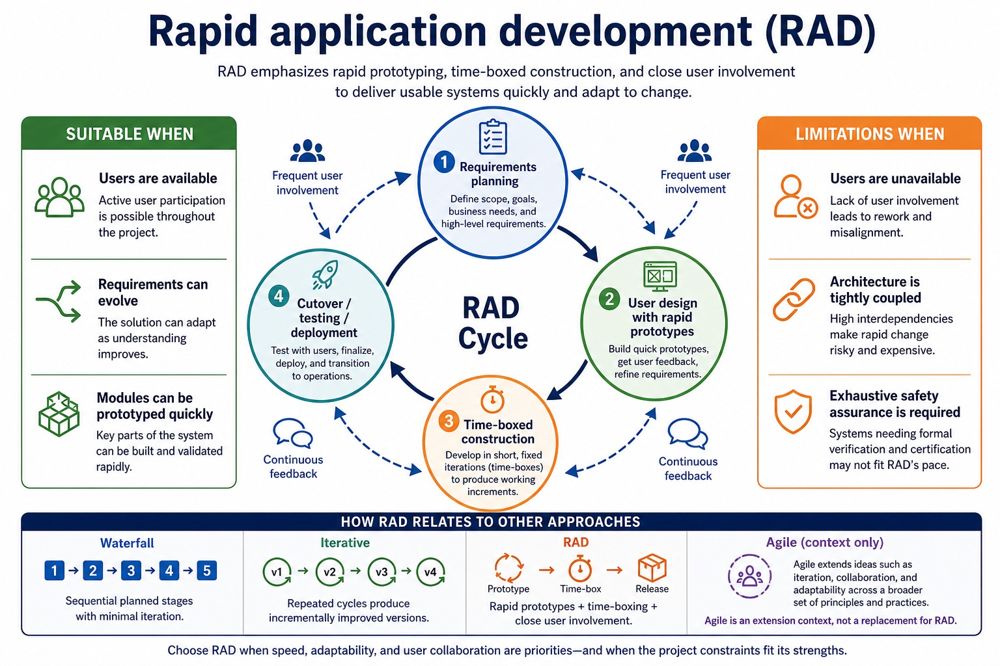

Text transcript

- RAD builds rapid prototypes inside short time boxes.
- Users review prototypes frequently and their feedback changes the next version.
- RAD can respond quickly, but may not suit work requiring exhaustive assurance and stable architecture.

Precise syllabus wording

Understand why a program-development lifecycle is used; compare waterfall, iterative and RAD models and their stages.

Candidates should understand the purpose of a program-development lifecycle and the need for different lifecycles depending on the program being developed. Compare the principles, benefits and drawbacks of waterfall, iterative and Rapid Application Development (RAD). Lifecycle stages are analysis, design, coding, testing and maintenance.

### Supporting diagram library

#### Why short feedback cycles support change

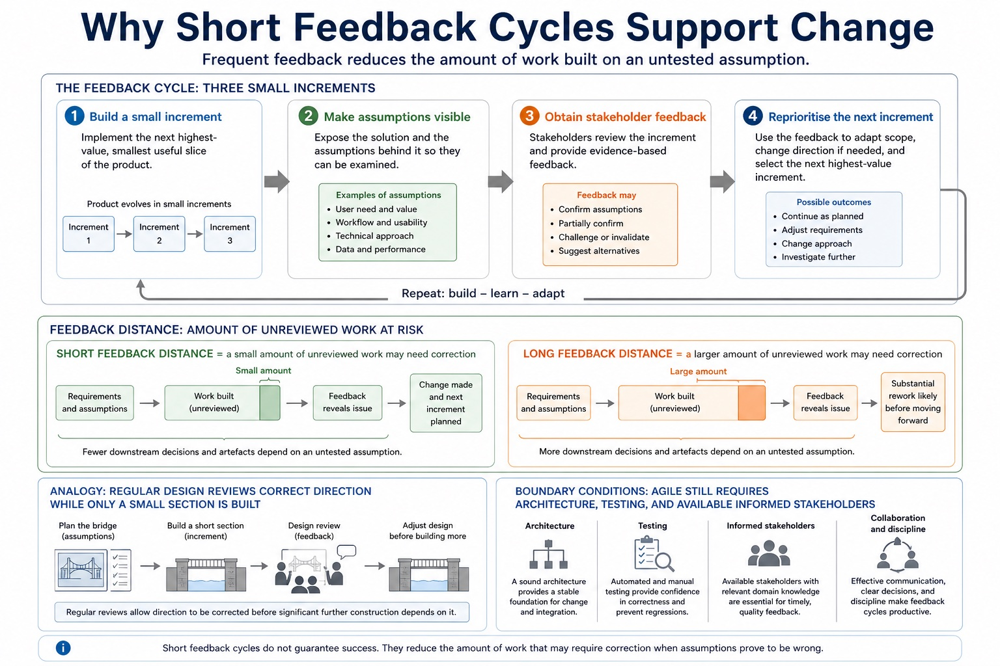

Text transcript

- A small increment makes assumptions visible quickly.
- Frequent stakeholder feedback reprioritises the next increment.
- Less unreviewed work depends on a mistaken requirement.

#### Why artefacts make decisions traceable

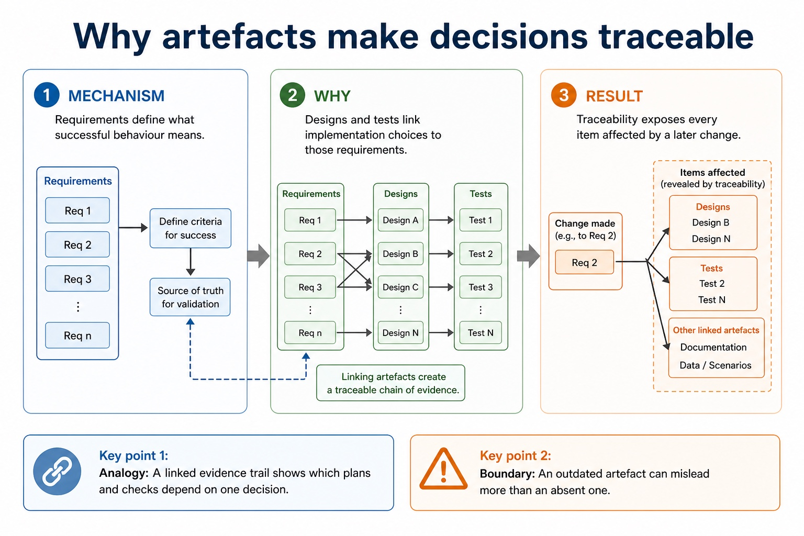

Text transcript

- Requirements define what successful behaviour means.
- Designs and tests link implementation choices to those requirements.
- Traceability exposes every item affected by a later change.

#### How project conditions choose a model

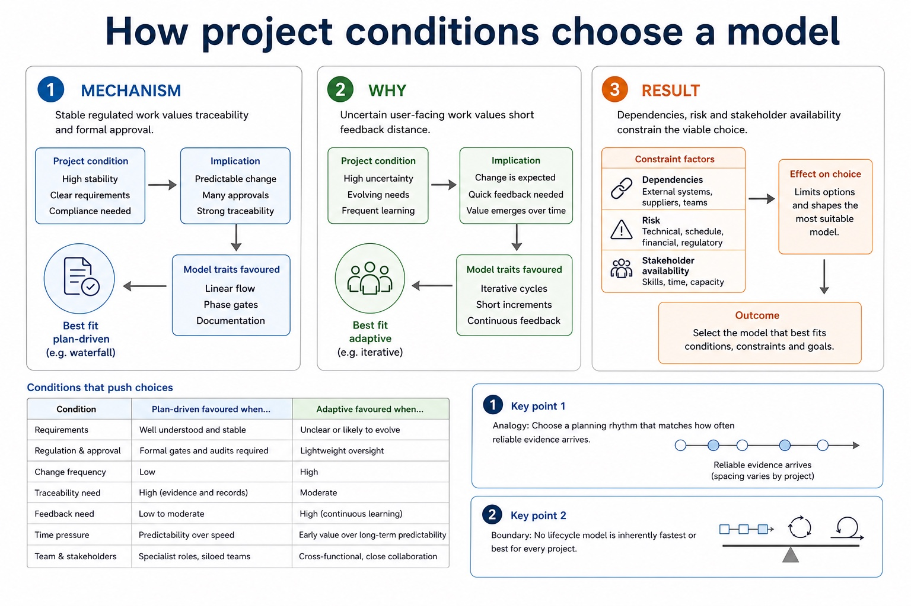

Text transcript

- Stable regulated work values traceability and formal approval.
- Uncertain user-facing work values short feedback distance.
- Dependencies, risk and stakeholder availability constrain the viable choice.

#### Why repeated cycles expose mistakes

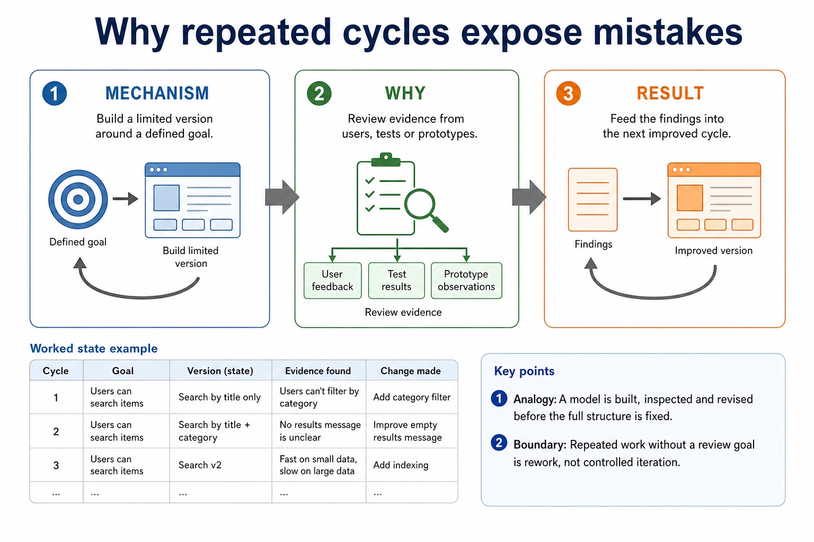

Text transcript

- Build a limited version around a defined goal.
- Review evidence from users, tests or prototypes.
- Feed the findings into the next improved cycle.

#### Why a lifecycle reduces uncertainty

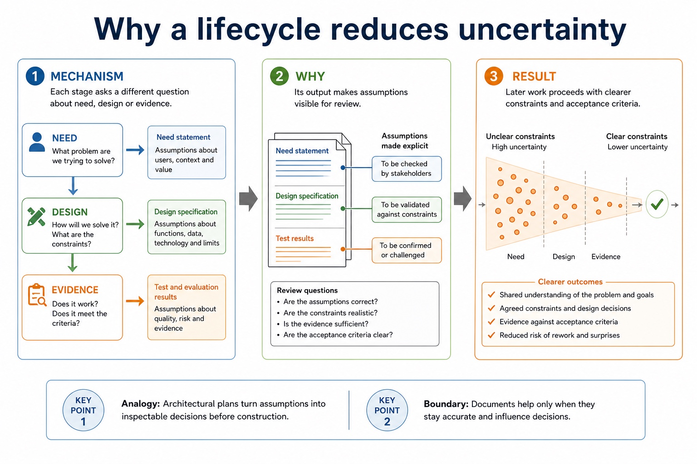

Text transcript

- Each stage asks a different question about need, design or evidence.
- Its output makes assumptions visible for review.
- Later work proceeds with clearer constraints and acceptance criteria.

#### How one stage supplies the next

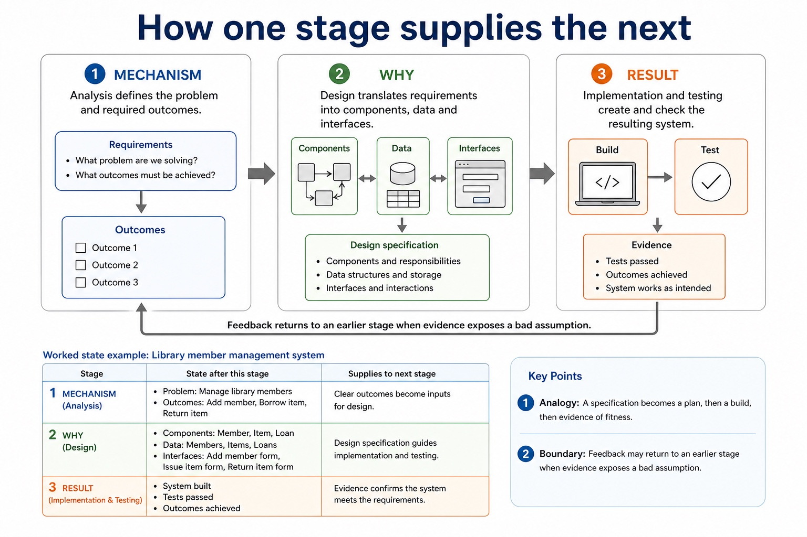

Text transcript

- Analysis defines the problem and required outcomes.
- Design translates requirements into components, data and interfaces.
- Implementation and testing create and check the resulting system.

#### Why sequence helps and resists change

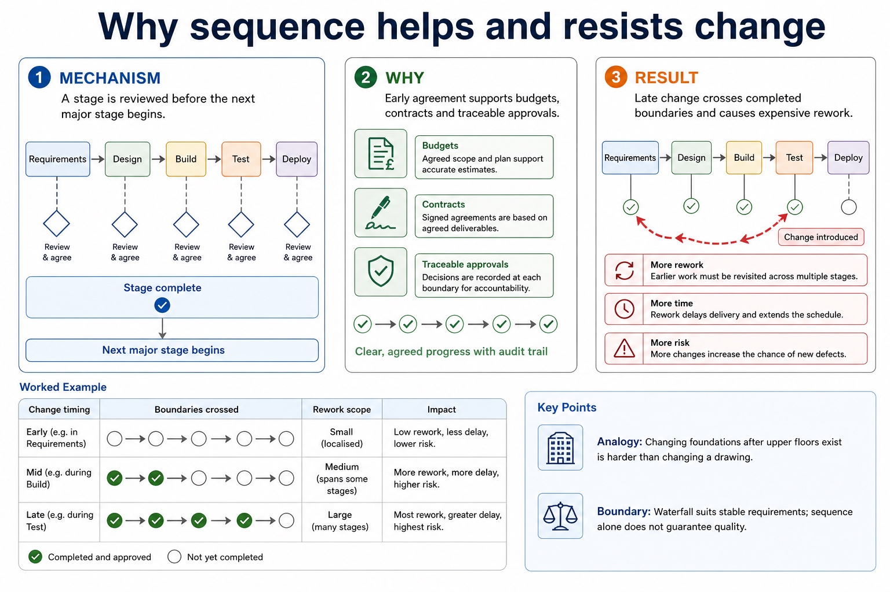

Text transcript

- A stage is reviewed before the next major stage begins.
- Early agreement supports budgets, contracts and traceable approvals.
- Late change crosses completed boundaries and causes expensive rework.

#### From vague request to measurable criteria

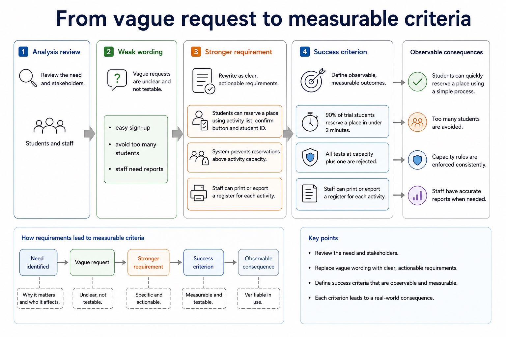

Text transcript

- Analysis review
- Weak wording
- Stronger requirement
- Success criterion
- easy sign-up
- students can reserve a place using activity list, confirm button and student ID
- 90% of trial students reserve a place in under 2 minutes
- avoid too many students

#### Turn a weak line into a mark-worthy line

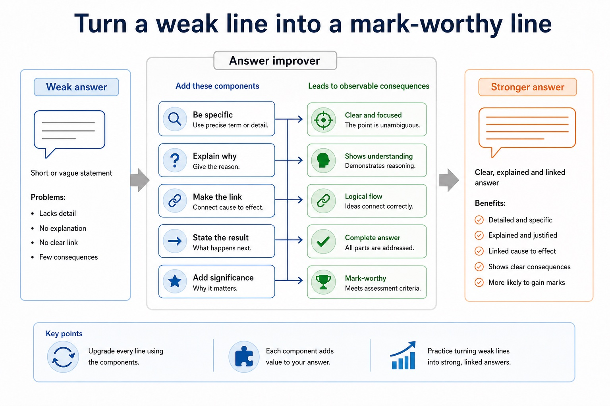

Text transcript

- Answer improver
- Weak answer

#### School activity sign-up system

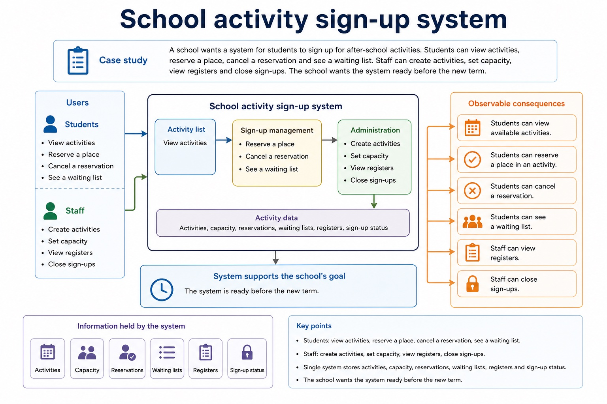

Text transcript

- Case study
- A school wants a system for students to sign up for after-school activities. Students can view activities,
- reserve a place, cancel a reservation and see a waiting list. Staff can create activities, set capacity,
- view registers and close sign-ups. The school wants the system ready before the new term.
- Every review task on this page uses this case. That forces answers to be specific instead of floating around as textbook fog.

#### Identify the Section 12 concept

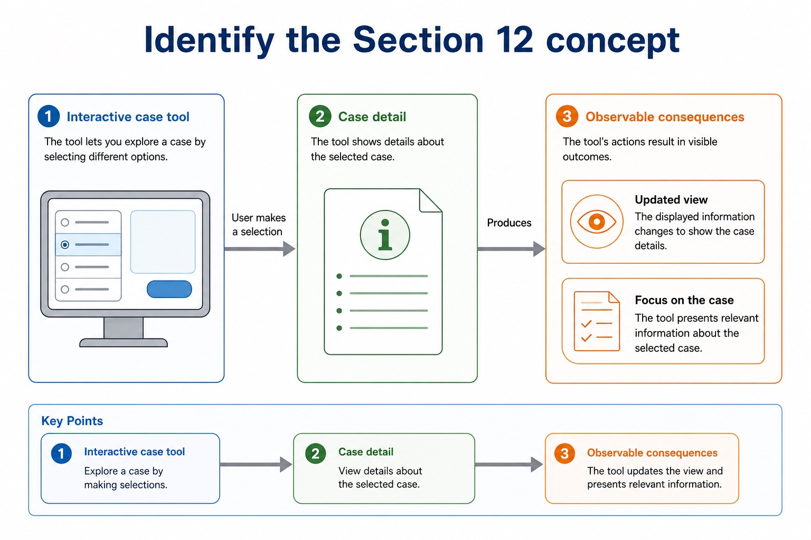

Text transcript

- Interactive case tool
- Case detail

#### Match response depth to the command

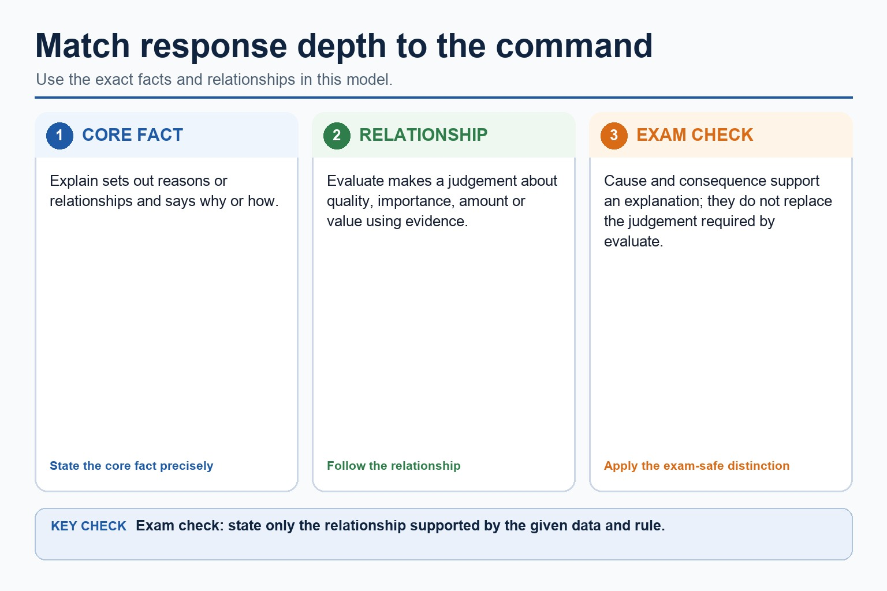

Text transcript

- Explain sets out reasons or relationships and says why or how.
- Evaluate makes a judgement about quality, importance, amount or value using evidence.
- Cause and consequence support an explanation; they do not replace the judgement required by evaluate.

#### Design answers must name the artefact

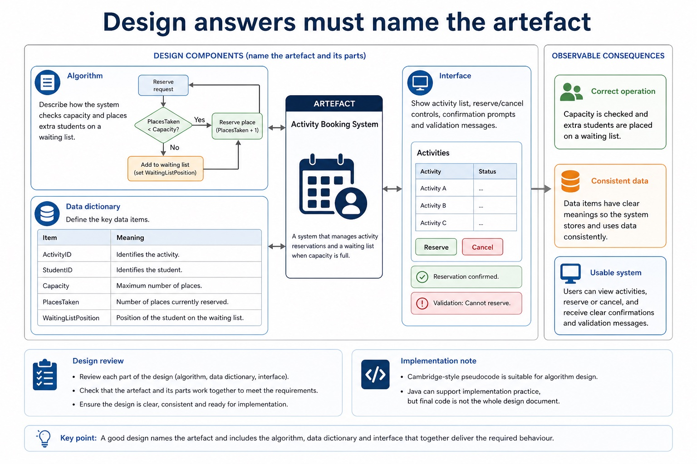

Text transcript

- Design review
- Algorithm
- Describe how the system checks capacity and places extra students on a waiting list.
- Data dictionary
- Define ActivityID, StudentID, Capacity, PlacesTaken and WaitingListPosition.
- Interface
- Show activity list, reserve/cancel controls, confirmation prompts and validation messages.
- Cambridge-style pseudocode is suitable for algorithm design. Java can support implementation practice, but final code is not the whole design document.

#### After release, classify changes and judge success with evidence

Text transcript

- Maintenance and evaluation review
- Maintenance examples
- Corrective: fix a crash when cancelling a reservation.
- Adaptive: change the system for a new two-term activity structure.
- Perfective: make the activity search faster or clearer.
- Evaluation evidence
- Timing logs from sign-up tasks.
- User survey results linked to success criteria.

#### One scenario, many stages

Text transcript

- The syllabus names analysis, design, coding, testing and maintenance as the program development lifecycle stages.
- Implementation may be used only as an explanation of coding, not as a replacement stage that removes testing or maintenance.
- Operation and evaluation are not substitutes for the five named syllabus stages.

#### Test cases need data, expected result and purpose

Text transcript

- Normal data is valid and typical; boundary data is at an accepted limit; abnormal data violates the stated validation rule.
- A 21st valid reservation at a capacity boundary requires the defined business outcome, such as waiting list or rejection due to capacity.
- Do not call a request invalid unless it violates a stated input-validity rule.

Open precise terminology and exam facts

- Candidates should understand the purpose of a program-development lifecycle and the need for different lifecycles depending on the program being developed. Compare the principles, benefits and drawbacks of waterfall, iterative and Rapid Application Development (RAD). Lifecycle stages are analysis, design, coding, testing and maintenance.
- Waterfall completes planned stages largely in sequence and supports documentation and traceability, but late change can cause substantial rework. Iterative development builds and reviews repeated versions so evidence can refine later cycles.
- Rapid application development (RAD) uses rapid prototyping, time-boxed development and frequent user involvement to obtain feedback quickly. It can suit an interactive system with available users, but speed and repeated prototypes can conflict with exhaustive assurance or stable architecture. Agile is related extension context, not a replacement for the named RAD model.
- A program-development lifecycle gives an organised sequence for analysis, design, implementation, testing and maintenance, with review and documentation linking decisions to evidence.
- Waterfall supports planned sequential stages and traceability but its limitation is costly late change. Iterative development reviews repeated versions but can need careful scope control. RAD uses rapid prototyping, time-boxing and user involvement; it may be less suitable or unsuitable where exhaustive assurance and stable architecture are required.

### Worked example

1. Choose a lifecycle model
2. Choose a lifecycle model
3. For a small booking interface with available users and changing requirements, RAD can use a time-boxed prototype and immediate user feedback.
4. For safety-critical stable requirements, waterfall's formal traceability may be more suitable than rapid prototyping.
5. RAD suits a small interface whose users can review frequent prototypes.
6. Waterfall may suit stable, safety-critical requirements where formal traceability matters, although late change remains a limitation.

Beyond syllabus / 延伸知识（不要求背诵）: modern teams often use continuous integration to repeat building and testing whenever a program changes.
## 3. Practice by question type

### Question 1 - foundation - compare - 8 marks

Compare waterfall, iterative and RAD for a system whose users can review frequent prototypes. Compare waterfall, iterative and RAD, including one limitation of each model.

**Answer:** waterfall uses planned sequential stages and formal documentation; iterative development reviews repeated versions; RAD uses rapid prototypes/time-boxing; RAD uses frequent user involvement and is linked to the scenario; waterfall and limitation; iterative and limitation; RAD features; RAD limitation/less suitable context

**Marking guidance:** Do not substitute Agile for RAD or describe all repeated development as the same model. Do not describe all lifecycle models as the same repeated process.

**Common error:** For the command word compare, perform that exact action; do not replace it with an unrelated fact.

### Question 2 - application - identify - 2 marks

Identify three defining features of RAD.

**Answer:** Rapid prototyping, time-boxing and frequent user involvement/feedback.

**Marking guidance:** Award one mark for each distinct, technically accurate point or method step.

**Common error:** Do not repeat the same point in different words; each mark needs a separate idea or method step.

### Question 3 - transfer - explain - 2 marks

Why might RAD be unsuitable for a safety-critical system?

**Answer:** Rapid cycles may not provide the exhaustive assurance and traceability required.

**Marking guidance:** Award one mark for each distinct, technically accurate point or method step.

**Common error:** Do not copy the worked example unchanged; transfer the method and check it against the new context.

### Related past-paper indexes

| Reference | Marks | Command word | Question type |
|---|---:|---|---|
| 9618/22/S/25 Q1(c) | 4 | complete | recall |
| 9618/22/S/25 Q1(i) | 3 | explain | explain |
| 9618/22/S/25 Q1(iii) | 2 | explain | explain |
| 9618/22/S/25 Q1(i) | 1 | explain | explain |

These are indexes only. Cambridge question and mark-scheme wording is not reproduced.

## 4. Summary and exam reminders

### Summary

- Define program-development lifecycle models with the exact technical vocabulary expected by the syllabus.
- Use the lesson method on a fresh context and show the intermediate decision, representation or calculation.
- Match the shape of the answer to the command word and the available marks.
- Check the final answer against the scenario instead of repeating a memorised sentence.

### Common error to correct

Students often describe the lifecycle as a fixed checklist. Correction: development is iterative; findings can send a project back to earlier stages.

### Exam technique

- Follow the command word: state gives a fact; explain links a cause to a consequence; compare covers both sides.
- Match the number of independent points or method steps to the available marks.
- For program-development lifecycle models, use the exact technical term before applying it to the scenario.
