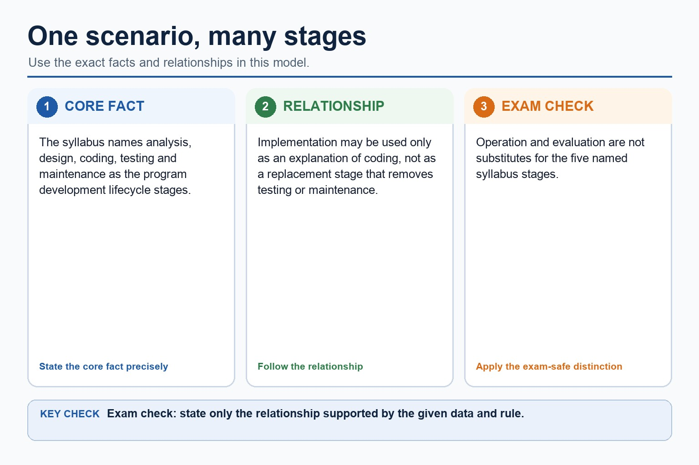

# Lesson 081: Program-development lifecycle models

**Course:** Cambridge International AS Level Computer Science 9618, 2027-2029 Version 2 
**Paper:** Paper 2 
**Syllabus:** Section 12: Software development 
**Syllabus requirements:** S12.01 
**Pacing:** Flexible. This lesson is deliberately over-complete; select a quick, full or deep route for the learners in front of you.

## Teaching-depth menu

- **Quick route:** Use the diagnostic, learning objectives, first worked example and foundation question. Stop once the learner can explain the central distinction accurately.
- **Full route:** Teach every core explanation point, the worked example and all lesson questions. Use the visual only when it adds a different representation.
- **Deep route:** Add the prerequisite refresher, ask learners to connect the concept checklist, discuss the labelled extension and complete a transfer question without a model answer.

## 1. Prerequisite knowledge and quick diagnostic

Recall the main conclusion from Lesson 080: Writing complete program fragments.

Ask the learner to give one accurate definition or method step before continuing. If they cannot, briefly revisit the named prerequisite rather than repeating the whole previous lesson.

## 2. Knowledge explanation

### Learning objectives

- Understand why a program-development lifecycle is used; compare waterfall, iterative and RAD models and their stages.

### Concept checklist for teacher choice

- RAD
- rapid prototyping
- time-box / timebox / time-boxed / time-boxing
- user involvement
- waterfall
- iterative
- limitation / less suitable / unsuitable

### Detailed explanation

- Candidates should understand the purpose of a program-development lifecycle and the need for different lifecycles depending on the program being developed. Compare the principles, benefits and drawbacks of waterfall, iterative and Rapid Application Development (RAD). Lifecycle stages are analysis, design, coding, testing and maintenance.
- Waterfall completes planned stages largely in sequence and supports documentation and traceability, but late change can cause substantial rework. Iterative development builds and reviews repeated versions so evidence can refine later cycles.
- Rapid application development (RAD) uses rapid prototyping, time-boxed development and frequent user involvement to obtain feedback quickly. It can suit an interactive system with available users, but speed and repeated prototypes can conflict with exhaustive assurance or stable architecture. Agile is related extension context, not a replacement for the named RAD model.
- A program-development lifecycle gives an organised sequence for analysis, design, implementation, testing and maintenance, with review and documentation linking decisions to evidence.
- Waterfall supports planned sequential stages and traceability but its limitation is costly late change. Iterative development reviews repeated versions but can need careful scope control. RAD uses rapid prototyping, time-boxing and user involvement; it may be less suitable or unsuitable where exhaustive assurance and stable architecture are required.

### Worked example

Choose a lifecycle model / Choose a lifecycle model: For a small booking interface with available users and changing requirements, RAD can use a time-boxed prototype and immediate user feedback. For safety-critical stable requirements, waterfall's formal traceability may be more suitable than rapid prototyping. RAD suits a small interface whose users can review frequent prototypes. Waterfall may suit stable, safety-critical requirements where formal traceability matters, although late change remains a limitation.

Beyond syllabus / 延伸知识（不要求背诵）: modern teams often use continuous integration to repeat building and testing whenever a program changes.

### Retained visual explanation

_One scenario, many stages. The image and mobile text alternative come from one maintained fact source._

## 3. Practice by question type

### Question 1 - foundation - compare - 8 marks

Compare waterfall, iterative and RAD for a system whose users can review frequent prototypes. Compare waterfall, iterative and RAD, including one limitation of each model.

**Answer:** waterfall uses planned sequential stages and formal documentation; iterative development reviews repeated versions; RAD uses rapid prototypes/time-boxing; RAD uses frequent user involvement and is linked to the scenario; waterfall and limitation; iterative and limitation; RAD features; RAD limitation/less suitable context

**Marking guidance:** Do not substitute Agile for RAD or describe all repeated development as the same model. Do not describe all lifecycle models as the same repeated process.

**Common error:** For the command word compare, perform that exact action; do not replace it with an unrelated fact.

### Question 2 - application - identify - 2 marks

Identify three defining features of RAD.

**Answer:** Rapid prototyping, time-boxing and frequent user involvement/feedback.

**Marking guidance:** Award one mark for each distinct, technically accurate point or method step.

**Common error:** Do not repeat the same point in different words; each mark needs a separate idea or method step.

### Question 3 - transfer - explain - 2 marks

Why might RAD be unsuitable for a safety-critical system?

**Answer:** Rapid cycles may not provide the exhaustive assurance and traceability required.

**Marking guidance:** Award one mark for each distinct, technically accurate point or method step.

**Common error:** Do not copy the worked example unchanged; transfer the method and check it against the new context.

### Related past-paper indexes

| Reference | Marks | Command word | Question type |
|---|---:|---|---|
| 9618/22/S/25 Q1(c) | 4 | complete | recall |
| 9618/22/S/25 Q1(i) | 3 | explain | explain |
| 9618/22/S/25 Q1(iii) | 2 | explain | explain |
| 9618/22/S/25 Q1(i) | 1 | explain | explain |

These are indexes only. Cambridge question and mark-scheme wording is not reproduced.

## 4. Summary and exam reminders

### Summary

- Define program-development lifecycle models with the exact technical vocabulary expected by the syllabus.
- Use the lesson method on a fresh context and show the intermediate decision, representation or calculation.
- Match the shape of the answer to the command word and the available marks.
- Check the final answer against the scenario instead of repeating a memorised sentence.

### Common error to correct

Students often describe the lifecycle as a fixed checklist. Correction: development is iterative; findings can send a project back to earlier stages.

### Exam technique

- Follow the command word: state gives a fact; explain links a cause to a consequence; compare covers both sides.
- Match the number of independent points or method steps to the available marks.
- For program-development lifecycle models, use the exact technical term before applying it to the scenario.
