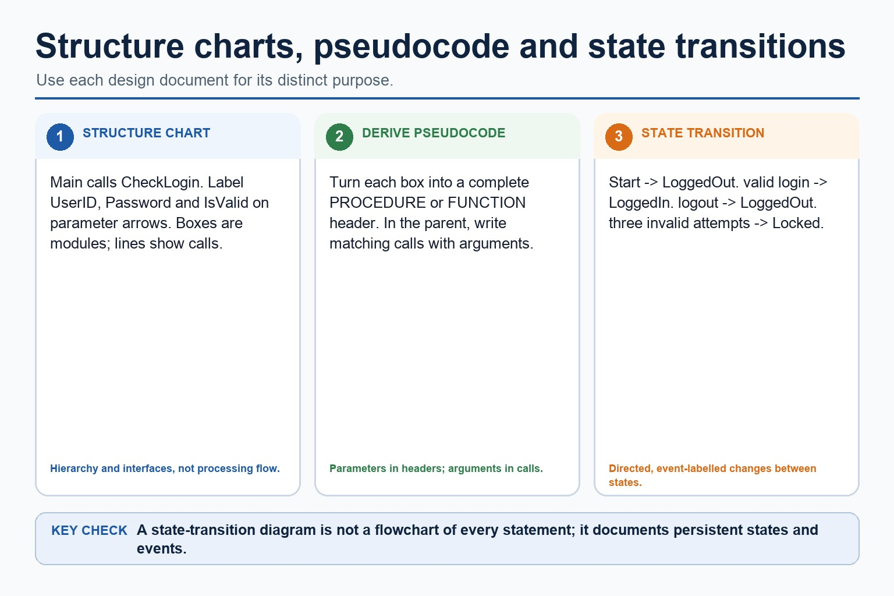

# Lesson 082: Structure charts and module interfaces

**Course:** Cambridge International AS Level Computer Science 9618, syllabus for examination in 2027-2029 
**Paper:** Paper 2 
**Syllabus:** Section 12: Software development 
**Syllabus requirements:** S12.02 
**Pacing:** Flexible. Select a quick, full or deep route for the learners in front of you.

## Teaching-depth menu

- **Quick route:** Use the diagnostic, learning objectives, first worked example and foundation question. Stop once the learner can explain the central distinction accurately.
- **Full route:** Teach every knowledge-point material set, the worked method and all lesson questions.
- **Deep route:** Add the prerequisite refresher, ask learners to connect the concept checklist, discuss the labelled extension and complete a transfer question without a model answer.

## 1. Prerequisite knowledge and quick diagnostic

Recall S11.06 before starting this lesson.

Ask the learner to give one accurate definition or method step before continuing. If they cannot, briefly revisit the named prerequisite rather than repeating the whole previous lesson.

### Optional prerequisite refresher

- Define and use a procedure; explain when the use of a procedure is appropriate; use parameters with none, one or more values passed by reference or by value.
- Understand and use procedures with parameters passed by reference and by value.

## 2. Knowledge explanation

### 1. Understand, construct and use structure charts, including parameters, and derive pseudocode (S12.02)

**Atomic learning targets**

- **S12.02.A01:** structure
- **S12.02.A02:** charts
- **S12.02.A03:** parameters
- **S12.02.A04:** derive
- **S12.02.A05:** pseudocode

**Core explanation**

- A structure chart documents decomposition before coding. Each box names a module, procedure or function; hierarchy lines show which module calls another; labelled arrows show the parameters passed across an interface.
- To construct the chart, put the controlling module at the top, split the task into single-responsibility subtasks, connect each caller to the modules it invokes, and label every data or control value passed.
- Parameters make module interfaces explicit. An input parameter supplies a value needed by the called module, while an output or by-reference parameter carries a changed result back where that interface is intended.
- To derive equivalent pseudocode, turn every chart box into a PROCEDURE or FUNCTION with matching formal parameters, then write calls in the parent modules using arguments in the same order and with compatible types.
- The pseudocode is equivalent only if it preserves the chart's hierarchy, call relationships and parameter flow; merely listing module names does not implement the design.

**Mechanism or method**

1. **Identify the relevant condition or input** — A structure chart documents decomposition before coding.
2. **Trace how the process works** — Each box names a module, procedure or function;
3. **Connect the mechanism to its result** — hierarchy lines show which module calls another;

#### Worked example: Understand, construct and use structure charts, including parameters, and derive pseudocode: complete worked route

1. **Identify the relevant condition or input**

A structure chart documents decomposition before coding.

2. **Trace how the process works**

Each box names a module, procedure or function;

3. **Connect the mechanism to its result**

hierarchy lines show which module calls another;

4. **Complete example**

Door controller: two design views: A structure chart places ControlDoor above ReadCard(CardID), ValidateCard(CardID, IsValid) and SetLock(IsValid). Equivalent pseudocode declares those interfaces and calls them from ControlDoor with matching arguments.

**Misconceptions to correct**

- Students often describe the lifecycle as a fixed checklist. Correction: development is iterative; findings can send a project back to earlier stages.

#### Mastery check (MC-L082-S12.02)

Explain the following targets in one connected answer, using a concrete example for each: structure; charts; parameters; derive; pseudocode.

Answer criteria

- A structure chart documents decomposition before coding. Each box names a module, procedure or function; hierarchy lines show which module calls another; labelled arrows show the parameters passed across an interface.
- To construct the chart, put the controlling module at the top, split the task into single-responsibility subtasks, connect each caller to the modules it invokes, and label every data or control value passed.
- Parameters make module interfaces explicit. An input parameter supplies a value needed by the called module, while an output or by-reference parameter carries a changed result back where that interface is intended.
- To derive equivalent pseudocode, turn every chart box into a PROCEDURE or FUNCTION with matching formal parameters, then write calls in the parent modules using arguments in the same order and with compatible types.
- The pseudocode is equivalent only if it preserves the chart's hierarchy, call relationships and parameter flow; merely listing module names does not implement the design.

**Supplementary concept map**

- **structure:** Understand, construct and use structure charts, including parameters,…
- **charts:** To derive equivalent pseudocode, turn each box into…
- **parameters:** A structure chart shows module hierarchy, calling relationships…
- **derive:** Its purpose, construct one for a given problem…
- **pseudocode:** Derive pseudocode by turning each box into a…

**Supplementary three-step recap**

1. **Translate the stated design** — To derive equivalent pseudocode, turn each box into a complete PROCEDURE or FUNCTION header with corresponding parameters, add…
2. **Apply one complete operation** — Its purpose, construct one for a given problem and derive equivalent pseudocode from it.
3. **Trace state and boundaries** — A structure chart shows module hierarchy, calling relationships and labelled parameters passed between modules, procedures or functions.

**Structure charts, derived pseudocode and state transitions:** A structure chart shows module hierarchy, calling relationships and labelled parameters passed between modules, procedures or functions. Derive pseudocode by turning each box into a complete subprogram header and each hierarchy connection into a…

#### Structure charts, derived pseudocode and state transitions

Text transcript

- A structure chart shows module hierarchy, calling relationships and labelled parameters passed between modules, procedures or functions.
- Derive pseudocode by turning each box into a complete subprogram header and each hierarchy connection into a matching call with arguments.
- A separate state-transition diagram marks the start state and uses directed, event-labelled transitions between persistent states; it is not a flowchart of processing steps.

Precise syllabus wording

Understand, construct and use structure charts, including parameters, and derive pseudocode.

Use a structure chart to decompose a problem into subtasks and express the parameters passed between modules, procedures and functions. Describe its purpose, construct one for a given problem and derive equivalent pseudocode from it.

### Lesson technical reference

- Use a structure chart to decompose a problem into subtasks and express the parameters passed between modules, procedures and functions. Describe its purpose, construct one for a given problem and derive equivalent pseudocode from it.
- A structure chart documents decomposition into modules, procedures and functions. Boxes name modules; hierarchy lines show which module calls another; labelled arrows show data or control parameters passed between them. Its purpose is to communicate modular structure and interfaces before coding.
- To construct a structure chart, place the controlling module at the top, split the problem into one-responsibility subtasks, connect each caller to its called modules, and label every value passed. To derive equivalent pseudocode, turn each box into a complete PROCEDURE or FUNCTION header with corresponding parameters, add calls in the parent body with matching arguments, and preserve the shown hierarchy.
- A state-transition diagram documents an algorithm by showing persistent states and the events that cause changes between them. Its syllabus requirement is to understand that purpose; constructing a state-transition diagram is retained only as Optional enrichment.

Beyond syllabus / 延伸知识（不要求背诵）: modern teams often use continuous integration to repeat building and testing whenever a program changes.
## 3. Practice by question type

### Question 1 - foundation - construct - 6 marks

For a login system, construct a structure chart in which Main calls ReadCredentials(UserID, Password) and CheckLogin(UserID, Password, IsValid), then derive equivalent subprogram headers and calls. A separate diagram shows LoggedOut, LoggedIn and Locked states: explain the purpose of this state-transition diagram.

**Answer:** structure chart places Main above the two called modules; parameter arrows label UserID, Password and IsValid coherently; derived pseudocode contains matching complete headers and calls with arguments; identifies persistent states in the provided state-transition diagram; explains that labelled transitions show event-driven changes; distinguishes this purpose from module hierarchy or a flowchart of processing steps

**Marking guidance:** Do not award construction marks for the state-transition diagram; the construction marks apply to the structure chart only.

**Common error:** For the command word construct, perform that exact action; do not replace it with an unrelated fact.

### Question 2 - application - apply - 2 marks

What does a box represent in a structure chart?

**Answer:** A module, procedure or function.

**Marking guidance:** Award one mark for each distinct, technically accurate point or method step.

**Common error:** Do not repeat the same point in different words; each mark needs a separate idea or method step.

### Question 3 - transfer - explain - 2 marks

How are parameters represented and then derived into pseudocode?

**Answer:** Labelled arrows show values passed; the same values appear as parameters in the called header and arguments in the caller's call.

**Marking guidance:** Award one mark for each distinct, technically accurate point or method step.

**Common error:** Do not copy the worked example unchanged; transfer the method and check it against the new context.

### Related past-paper indexes

| Reference | Marks | Command word | Question type |
|---|---:|---|---|
| 9618/21/W/25 Q7(b) | 5 | complete | recall |
| 9618/22/W/25 Q8(a) | 4 | complete | write |
| 9618/23/W/25 Q7(b) | 4 | complete | recall |
| 9618/22/W/23 Q7(a) | 4 | complete | recall |

These are indexes only. Cambridge question and mark-scheme wording is not reproduced.

## 4. Summary and exam reminders

### Summary

- S12.02: explain structure, charts, parameters, derive, pseudocode.
- S12.02 method: Identify the relevant condition or input → Trace how the process works → Connect the mechanism to its result.
- Correction to remember: Students often describe the lifecycle as a fixed checklist. Correction: development is iterative; findings can send a project back to earlier stages.

### Common error to correct

Students often describe the lifecycle as a fixed checklist. Correction: development is iterative; findings can send a project back to earlier stages.

### Exam technique

- Follow the command word: state gives a fact; explain links a cause to a consequence; compare covers both sides.
- Match the number of independent points or method steps to the available marks.
- For structure charts and module interfaces, use the exact technical term before applying it to the scenario.
