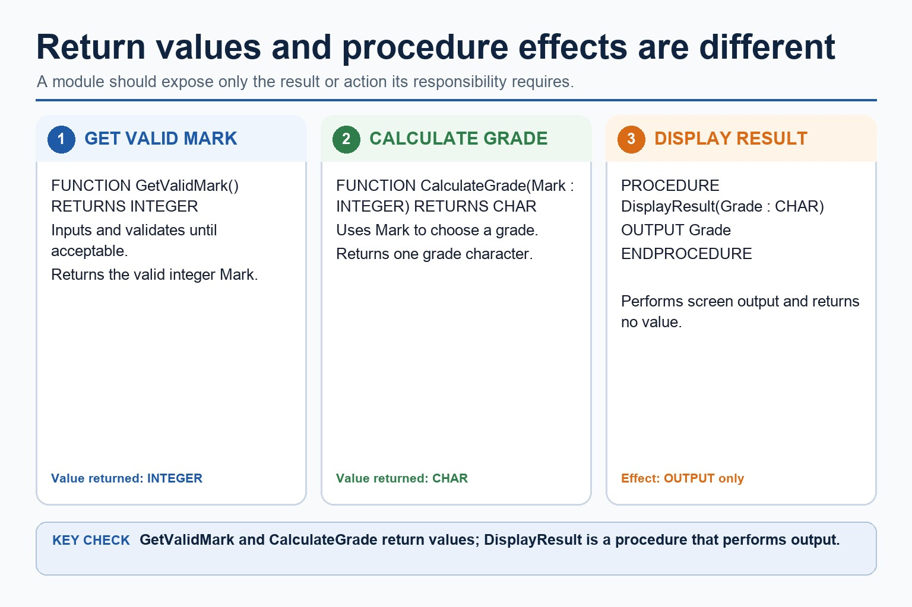
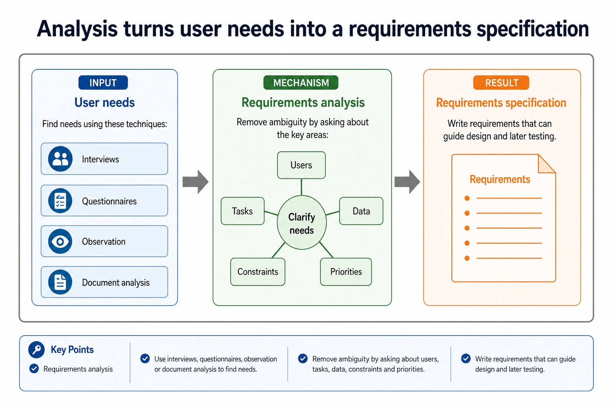
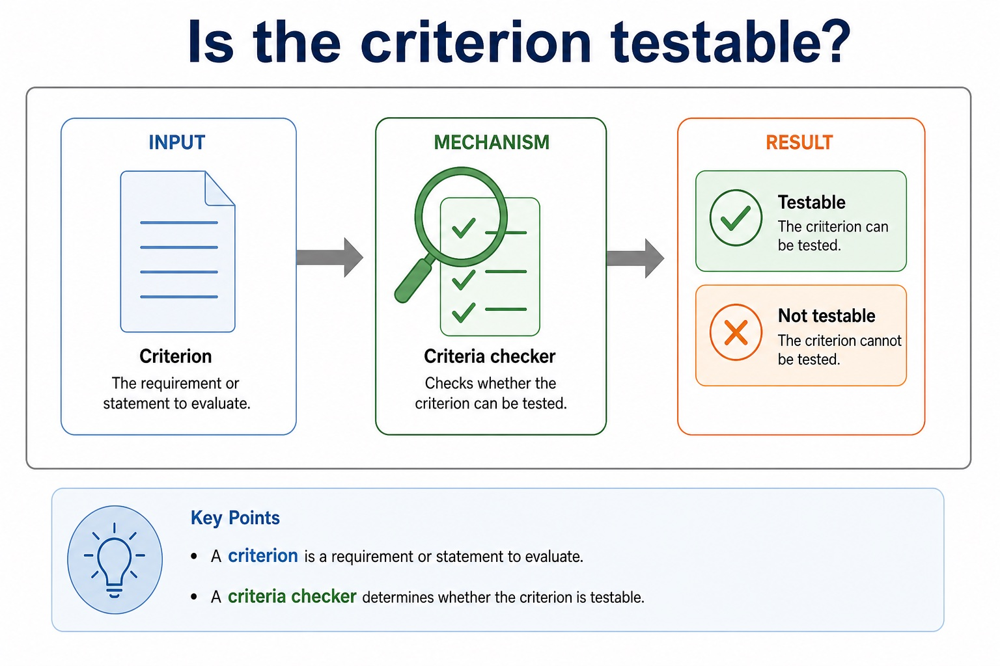
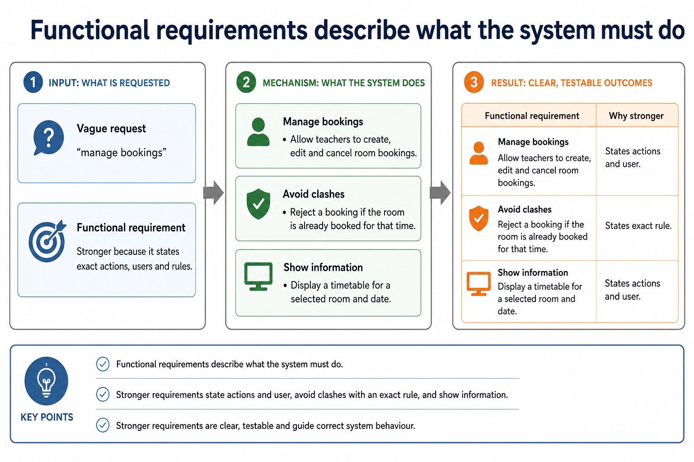
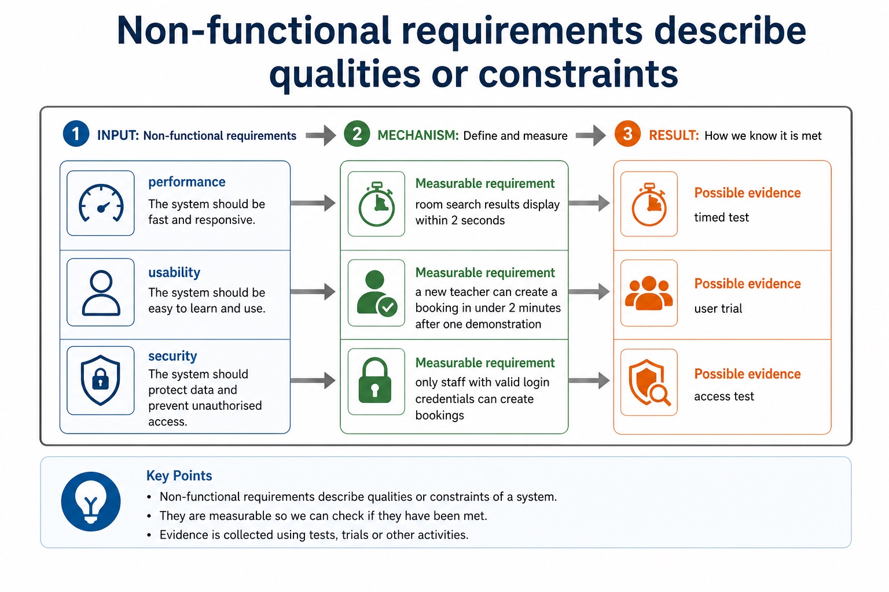
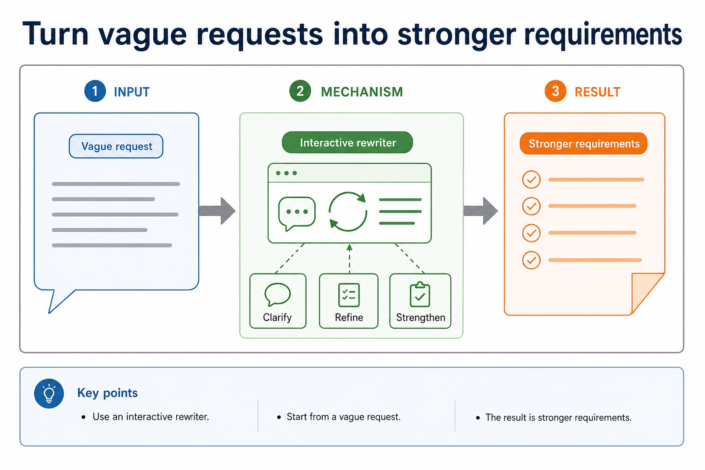
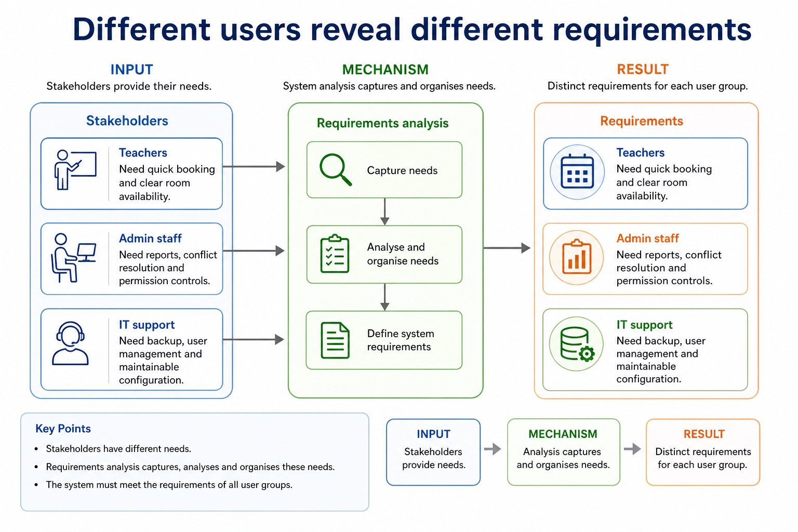
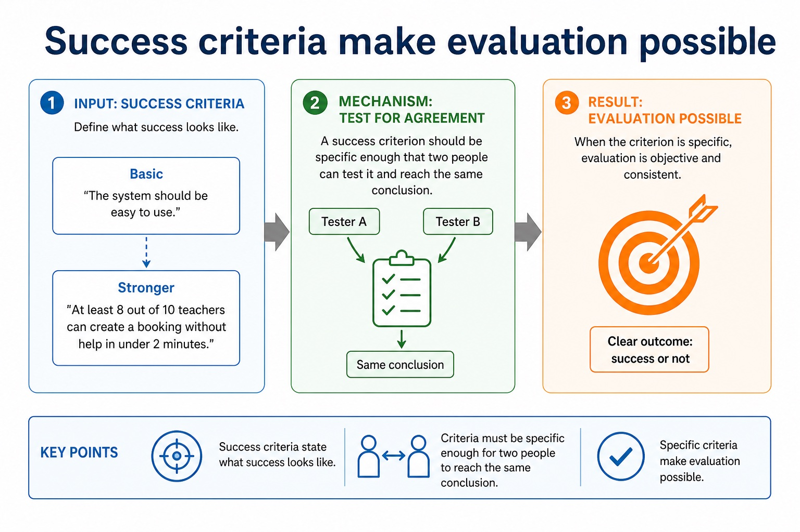

# Lesson 082: Structure charts and module interfaces

**Course:** Cambridge International AS Level Computer Science 9618, 2027-2029 Version 2 
**Paper:** Paper 2 
**Syllabus:** Section 12: Software development 
**Syllabus requirements:** S12.02 
**Pacing:** Flexible. Select the material set and practice depth needed by the learner.

## Teaching-depth menu

- **Quick route:** Use the diagnostic, learning objectives, first worked example and foundation question. Stop once the learner can explain the central distinction accurately.
- **Full route:** Use every knowledge-point material set, the worked method, the terminology check and all questions.
- **Deep route:** Add the prerequisite refresher, ask learners to connect the concept checklist, discuss the labelled extension and complete a transfer question without a model answer.

## 1. Prerequisite knowledge and quick diagnostic

Recall S11.06 before starting this lesson.

Ask the learner to give one accurate definition or method step before continuing. If they cannot, briefly revisit the named prerequisite rather than repeating the whole previous lesson.

### Optional prerequisite refresher

- Define and use a procedure; explain when the use of a procedure is appropriate; use parameters with none, one or more values passed by reference or by value.
- Understand and use procedures with parameters passed by reference and by value.

## 2. Knowledge explanation

### 1. Structure charts and module parameters (S12.02)

**Concept map:** structure → charts → parameters → derive → pseudocode

**Three-part explanation:**

1. Use a structure chart to decompose a problem into subtasks and express the parameters passed between modules, procedures and functions
2. Describe its purpose, construct one for a given problem and derive equivalent pseudocode from it
3. To construct a structure chart, place the controlling module at the top, split the problem into one-responsibility subtasks, connect each caller to its called modules, and…

**Concrete cue:** Use a structure chart to decompose a problem into subtasks and express the parameters passed between modules, procedures and functions. Describe its purpose, construct one for a given problem and…

#### Structure charts, derived pseudocode and state transitions

Text transcript

- A structure chart shows module hierarchy, calling relationships and labelled parameters passed between modules, procedures or functions.
- Derive pseudocode by turning each box into a complete subprogram header and each hierarchy connection into a matching call with arguments.
- A separate state-transition diagram marks the start state and uses directed, event-labelled transitions between persistent states; it is not a flowchart of processing steps.

#### Pass data into a module and return only what is needed

Text transcript

- Parameter arrows on a structure chart document the values passed between modules.
- A function returns a value to its caller, while a procedure performs an action without returning a value.
- The module interface must match the corresponding pseudocode header and call.

Precise syllabus wording

Understand, construct and use structure charts, including parameters, and derive pseudocode.

Use a structure chart to decompose a problem into subtasks and express the parameters passed between modules, procedures and functions. Describe its purpose, construct one for a given problem and derive equivalent pseudocode from it.

### Supporting diagram library

#### A subprogram interface connects caller and header

Text transcript

- A subprogram interface gives the caller the name, parameter list and types, and any return value or type.
- A procedure or function header declares that interface.
- A parameter is named in the header; an argument is the actual value or variable supplied at a call.

#### Acceptance tests check whether requirements are met

Text transcript

- Acceptance tests
- Requirement
- Test data/action
- Expected result
- Evidence
- reject double booking
- try to book Room 12 at an occupied time
- booking rejected with message

#### Analysis turns user needs into a requirements specification

Text transcript

- Requirements analysis
- Use interviews, questionnaires, observation or document analysis to find needs.
- Remove ambiguity by asking about users, tasks, data, constraints and priorities.
- Write requirements that can guide design and later testing.

#### Is the criterion testable?

Text transcript

- Criteria checker
- Criterion

#### Functional requirements describe what the system must do

Text transcript

- Functional requirements
- Vague request
- Functional requirement
- Why stronger
- manage bookings
- allow teachers to create, edit and cancel room bookings
- states actions and user
- avoid clashes

#### Non-functional requirements describe qualities or constraints

Text transcript

- Non-functional requirements
- Measurable requirement
- Possible evidence
- performance
- room search results display within 2 seconds
- timed test
- usability
- a new teacher can create a booking in under 2 minutes after one demonstration

#### Turn vague requests into stronger requirements

Text transcript

- Interactive rewriter
- Vague request

#### Different users reveal different requirements

Text transcript

- Stakeholders
- Teachers
- Need quick booking and clear room availability.
- Admin staff
- Need reports, conflict resolution and permission controls.
- IT support
- Need backup, user management and maintainable configuration.

#### Success criteria make evaluation possible

Text transcript

- Success criteria
- “The system should be easy to use.”
- Stronger
- “At least 8 out of 10 teachers can create a booking without help in under 2 minutes.”
- A success criterion should be specific enough that two people can test it and reach the same conclusion.

Open precise terminology and exam facts

- Use a structure chart to decompose a problem into subtasks and express the parameters passed between modules, procedures and functions. Describe its purpose, construct one for a given problem and derive equivalent pseudocode from it.
- A structure chart documents decomposition into modules, procedures and functions. Boxes name modules; hierarchy lines show which module calls another; labelled arrows show data or control parameters passed between them. Its purpose is to communicate modular structure and interfaces before coding.
- To construct a structure chart, place the controlling module at the top, split the problem into one-responsibility subtasks, connect each caller to its called modules, and label every value passed. To derive equivalent pseudocode, turn each box into a complete PROCEDURE or FUNCTION header with corresponding parameters, add calls in the parent body with matching arguments, and preserve the shown hierarchy.
- A state-transition diagram documents an algorithm by showing persistent states and the events that cause changes between them. Its syllabus requirement is to understand that purpose; constructing a state-transition diagram is retained only as Optional enrichment.

### Worked example

1. two design views
2. A structure chart places ControlDoor above ReadCard(CardID), ValidateCard(CardID, IsValid) and SetLock(IsValid).
3. Equivalent pseudocode declares those interfaces and calls them from ControlDoor with matching arguments.
4. A provided state-transition diagram with Locked and Unlocked states serves a different purpose
5. it documents event-driven changes rather than module hierarchy or processing sequence.

Beyond syllabus / 延伸知识（不要求背诵）: modern teams often use continuous integration to repeat building and testing whenever a program changes.
## 3. Practice by question type

### Question 1 - foundation - construct - 6 marks

For a login system, construct a structure chart in which Main calls ReadCredentials(UserID, Password) and CheckLogin(UserID, Password, IsValid), then derive equivalent subprogram headers and calls. A separate diagram shows LoggedOut, LoggedIn and Locked states: explain the purpose of this state-transition diagram.

**Answer:** structure chart places Main above the two called modules; parameter arrows label UserID, Password and IsValid coherently; derived pseudocode contains matching complete headers and calls with arguments; identifies persistent states in the provided state-transition diagram; explains that labelled transitions show event-driven changes; distinguishes this purpose from module hierarchy or a flowchart of processing steps

**Marking guidance:** Do not award construction marks for the state-transition diagram; the construction marks apply to the structure chart only.

**Common error:** For the command word construct, perform that exact action; do not replace it with an unrelated fact.

### Question 2 - application - apply - 2 marks

What does a box represent in a structure chart?

**Answer:** A module, procedure or function.

**Marking guidance:** Award one mark for each distinct, technically accurate point or method step.

**Common error:** Do not repeat the same point in different words; each mark needs a separate idea or method step.

### Question 3 - transfer - explain - 2 marks

How are parameters represented and then derived into pseudocode?

**Answer:** Labelled arrows show values passed; the same values appear as parameters in the called header and arguments in the caller's call.

**Marking guidance:** Award one mark for each distinct, technically accurate point or method step.

**Common error:** Do not copy the worked example unchanged; transfer the method and check it against the new context.

### Related past-paper indexes

| Reference | Marks | Command word | Question type |
|---|---:|---|---|
| 9618/21/W/25 Q7(b) | 5 | complete | recall |
| 9618/22/W/25 Q8(a) | 4 | complete | write |
| 9618/23/W/25 Q7(b) | 4 | complete | recall |
| 9618/22/W/23 Q7(a) | 4 | complete | recall |

These are indexes only. Cambridge question and mark-scheme wording is not reproduced.

## 4. Summary and exam reminders

### Summary

- Define structure charts and module interfaces with the exact technical vocabulary expected by the syllabus.
- Use the lesson method on a fresh context and show the intermediate decision, representation or calculation.
- Match the shape of the answer to the command word and the available marks.
- Check the final answer against the scenario instead of repeating a memorised sentence.

### Common error to correct

Students often describe the lifecycle as a fixed checklist. Correction: development is iterative; findings can send a project back to earlier stages.

### Exam technique

- Follow the command word: state gives a fact; explain links a cause to a consequence; compare covers both sides.
- Match the number of independent points or method steps to the available marks.
- For structure charts and module interfaces, use the exact technical term before applying it to the scenario.
