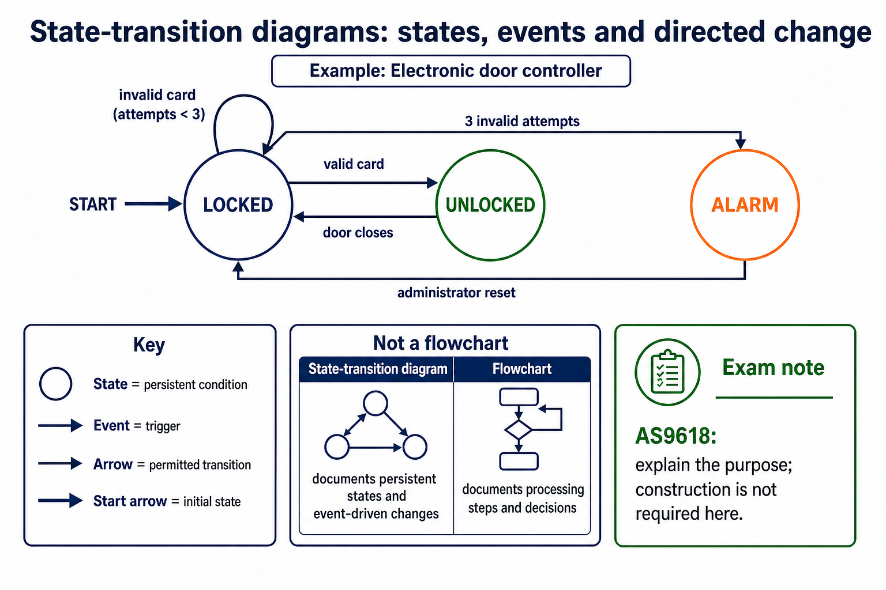

# Lesson 083: State-transition diagrams

**Course:** Cambridge International AS Level Computer Science 9618, 2027-2029 Version 2 
**Paper:** Paper 2 
**Syllabus:** Section 12: Software development 
**Syllabus requirements:** S12.03 
**Pacing:** Flexible. Select the material set and practice depth needed by the learner.

## Teaching-depth menu

- **Quick route:** Use the diagnostic, learning objectives, first worked example and foundation question. Stop once the learner can explain the central distinction accurately.
- **Full route:** Use every knowledge-point material set, the worked method, the terminology check and all questions.
- **Deep route:** Add the prerequisite refresher, ask learners to connect the concept checklist, discuss the labelled extension and complete a transfer question without a model answer.

## 1. Prerequisite knowledge and quick diagnostic

Recall S9.07 before starting this lesson.

Ask the learner to give one accurate definition or method step before continuing. If they cannot, briefly revisit the named prerequisite rather than repeating the whole previous lesson.

### Optional prerequisite refresher

- Document an algorithm using structured English, a flowchart or pseudocode; write pseudocode from structured English or a flowchart, and draw a flowchart from structured English or pseudocode while preserving the same algorithm.
- Use structured English, flowcharts and pseudocode; convert between representations.

## 2. Knowledge explanation

### 1. State-transition diagrams (S12.03)

**Concept map:** state-transition → diagrams

**Three-part explanation:**

1. it does not require candidates to construct a state-transition diagram
2. A state-transition diagram documents an algorithm by showing persistent states and the events that cause changes between them
3. constructing a state-transition diagram is retained only as Optional enrichment

**Concrete cue:** The Version 2 table requires understanding the purpose; it does not require candidates to construct a state-transition diagram.

#### State-transition diagrams: states, events and directed change

Text transcript

- A state is a persistent condition and an event is a trigger that may cause change.
- A directed arrow records a permitted transition and its event label explains what triggers it.
- The incoming start arrow marks the initial state.
- The door-controller example moves among LOCKED, UNLOCKED and ALARM states in response to card, door and reset events.
- A state-transition diagram documents states and event-driven change; a flowchart documents processing steps and decisions.

#### Structure charts, derived pseudocode and state transitions

Text transcript

- A state-transition diagram marks the initial state and uses directed, event-labelled transitions between persistent states.
- A state-transition diagram is not a flowchart of processing steps.
- The AS9618 requirement here is to explain the purpose of the diagram rather than construct one.

Precise syllabus wording

Show understanding of the purpose of state-transition diagrams to document an algorithm.

The Version 2 table requires understanding the purpose; it does not require candidates to construct a state-transition diagram.

### Supporting diagram library

#### Acceptance tests check whether requirements are met

Text transcript

- Acceptance tests
- Requirement
- Test data/action
- Expected result
- Evidence
- reject double booking
- try to book Room 12 at an occupied time
- booking rejected with message

#### Analysis turns user needs into a requirements specification

Text transcript

- Requirements analysis
- Use interviews, questionnaires, observation or document analysis to find needs.
- Remove ambiguity by asking about users, tasks, data, constraints and priorities.
- Write requirements that can guide design and later testing.

#### Is the criterion testable?

Text transcript

- Criteria checker
- Criterion

#### Functional requirements describe what the system must do

Text transcript

- Functional requirements
- Vague request
- Functional requirement
- Why stronger
- manage bookings
- allow teachers to create, edit and cancel room bookings
- states actions and user
- avoid clashes

#### Non-functional requirements describe qualities or constraints

Text transcript

- Non-functional requirements
- Measurable requirement
- Possible evidence
- performance
- room search results display within 2 seconds
- timed test
- usability
- a new teacher can create a booking in under 2 minutes after one demonstration

#### Turn vague requests into stronger requirements

Text transcript

- Interactive rewriter
- Vague request

#### Different users reveal different requirements

Text transcript

- Stakeholders
- Teachers
- Need quick booking and clear room availability.
- Admin staff
- Need reports, conflict resolution and permission controls.
- IT support
- Need backup, user management and maintainable configuration.

#### Success criteria make evaluation possible

Text transcript

- Success criteria
- “The system should be easy to use.”
- Stronger
- “At least 8 out of 10 teachers can create a booking without help in under 2 minutes.”
- A success criterion should be specific enough that two people can test it and reach the same conclusion.

Open precise terminology and exam facts

- The Version 2 table requires understanding the purpose; it does not require candidates to construct a state-transition diagram.
- A structure chart documents decomposition into modules, procedures and functions. Boxes name modules; hierarchy lines show which module calls another; labelled arrows show data or control parameters passed between them. Its purpose is to communicate modular structure and interfaces before coding.
- To construct a structure chart, place the controlling module at the top, split the problem into one-responsibility subtasks, connect each caller to its called modules, and label every value passed. To derive equivalent pseudocode, turn each box into a complete PROCEDURE or FUNCTION header with corresponding parameters, add calls in the parent body with matching arguments, and preserve the shown hierarchy.
- A state-transition diagram documents an algorithm by showing persistent states and the events that cause changes between them. Its syllabus requirement is to understand that purpose; constructing a state-transition diagram is retained only as Optional enrichment.

### Worked example

1. two design views
2. A structure chart places ControlDoor above ReadCard(CardID), ValidateCard(CardID, IsValid) and SetLock(IsValid).
3. Equivalent pseudocode declares those interfaces and calls them from ControlDoor with matching arguments.
4. A provided state-transition diagram with Locked and Unlocked states serves a different purpose
5. it documents event-driven changes rather than module hierarchy or processing sequence.

Beyond syllabus / 延伸知识（不要求背诵）: modern teams often use continuous integration to repeat building and testing whenever a program changes.
## 3. Practice by question type

### Question 1 - foundation - state - 2 marks

What does a state-transition diagram document?

**Answer:** The persistent states of an algorithm/system and the event-driven changes between them.

**Marking guidance:** Award one mark for each distinct, technically accurate point or method step.

**Common error:** For the command word state, perform that exact action; do not replace it with an unrelated fact.

### Question 2 - application - explain - 2 marks

How does a walkthrough differ from a dry run?

**Answer:** A walkthrough is a structured peer review of the algorithm or code; a dry run manually traces values and control flow for selected data.

**Marking guidance:** Award one mark for each distinct, technically accurate point or method step.

**Common error:** Do not repeat the same point in different words; each mark needs a separate idea or method step.

### Question 3 - transfer - state - 2 marks

State two precise facts about state-transition diagrams.

**Answer:** The Version 2 table requires understanding the purpose; it does not require candidates to construct a state-transition diagram. A structure chart documents decomposition into modules, procedures and functions. Boxes name modules; hierarchy lines show which module calls another; labelled arrows show data or control parameters passed between them. Its purpose is to communicate modular structure and interfaces before coding.

**Marking guidance:** Award one mark for each distinct fact; do not credit a repeated point.

**Common error:** Do not copy the worked example unchanged; transfer the method and check it against the new context.

### Related past-paper indexes

| Reference | Marks | Command word | Question type |
|---|---:|---|---|
| 9618/21/W/25 Q7(a) | 5 | complete | recall |
| 9618/23/W/25 Q7(a) | 5 | complete | recall |
| 9618/22/S/25 Q5(a) | 4 | complete | recall |
| 9618/21/W/23 Q7 | 5 | complete | recall |

These are indexes only. Cambridge question and mark-scheme wording is not reproduced.

## 4. Summary and exam reminders

### Summary

- Define state-transition diagrams with the exact technical vocabulary expected by the syllabus.
- Use the lesson method on a fresh context and show the intermediate decision, representation or calculation.
- Match the shape of the answer to the command word and the available marks.
- Check the final answer against the scenario instead of repeating a memorised sentence.

### Common error to correct

Students often describe the lifecycle as a fixed checklist. Correction: development is iterative; findings can send a project back to earlier stages.

### Exam technique

- Follow the command word: state gives a fact; explain links a cause to a consequence; compare covers both sides.
- Match the number of independent points or method steps to the available marks.
- For state-transition diagrams, use the exact technical term before applying it to the scenario.
