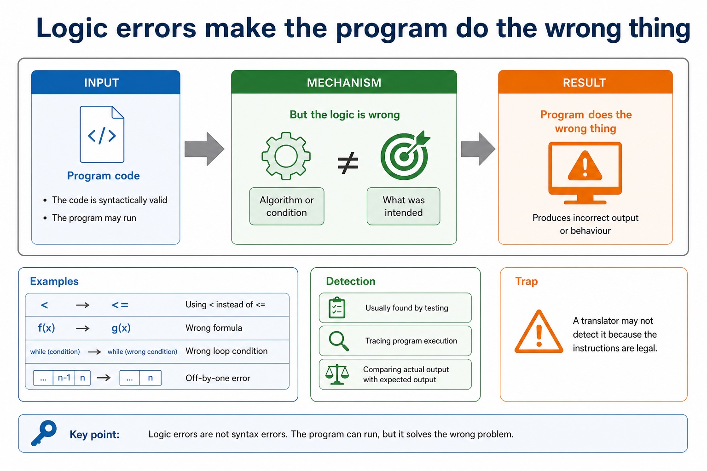

# Lesson 084: Finding and correcting program errors

**Course:** Cambridge International AS Level Computer Science 9618, syllabus for examination in 2027-2029 
**Paper:** Paper 2 
**Syllabus:** Section 12: Software development 
**Syllabus requirements:** S12.04 
**Pacing:** Flexible. Select a quick, full or deep route for the learners in front of you.

## Teaching-depth menu

- **Quick route:** Use the diagnostic, learning objectives, first worked example and foundation question. Stop once the learner can explain the central distinction accurately.
- **Full route:** Teach every knowledge-point material set, the worked method and all lesson questions.
- **Deep route:** Add the prerequisite refresher, ask learners to connect the concept checklist, discuss the labelled extension and complete a transfer question without a model answer.

## 1. Prerequisite knowledge and quick diagnostic

Recall the main conclusion from Lesson 083: State-transition diagrams.

Ask the learner to give one accurate definition or method step before continuing. If they cannot, briefly revisit the named prerequisite rather than repeating the whole previous lesson.

## 2. Knowledge explanation

### 1. Syntax, logic and runtime errors (S12.04)

**Concept relationships**

- **Syntax:** Breaks language grammar
- **Logic:** Runs but gives wrong result
- **Runtime:** Fails during execution
- **Correction:** Remove the identified cause
- **errors:** Locate and identify syntax, logic and run-time errors…

**Mechanism**

1. **Name the exact concept** — Locate and identify syntax, logic and run-time errors in a program and correct identified errors.
2. **Explain how its parts connect** — Syntax, logic and runtime errors.
3. **Use it in a concrete context** — A logic error uses valid syntax but follows the wrong algorithm, so a trace, dry run, walkthrough or…

**Logic errors make the program do the wrong…:** Meaning The code is syntactically valid and may run, but the algorithm or condition is wrong. Examples Using < instead of <= , wrong formula, wrong loop condition or off-by-one error.

#### Logic errors make the program do the wrong thing

Text transcript

- Meaning The code is syntactically valid and may run, but the algorithm or condition is wrong.
- Examples Using < instead of <= , wrong formula, wrong loop condition or off-by-one error.
- Detection Usually found by testing, tracing or comparing actual output with expected output.
- Common error A translator may not detect it because the instructions are legal.

Precise syllabus wording

Identify and correct syntax, logic and runtime errors.

Understand different ways of exposing and avoiding faults in a program. Locate and identify syntax, logic and run-time errors in a program and correct identified errors.

Open precise terminology and exam facts

- Understand different ways of exposing and avoiding faults in a program. Locate and identify syntax, logic and run-time errors in a program and correct identified errors.
- A syntax error breaks the language grammar and is normally exposed by a translator or an IDE's dynamic syntax check. A logic error uses valid syntax but follows the wrong algorithm, so a trace, dry run, walkthrough or deliberately selected test can expose an unexpected result. A run-time error occurs during execution, such as division by zero or opening a missing file, so exception messages and run-time diagnostics help locate it.
- After an error is exposed, locate the responsible statement and identify the error type before changing it. Correct the cause, not only the observed output, then rerun the failing test and relevant regression tests. Avoid faults by using clear identifiers, modular design, validation, desk checking, peer walkthroughs and a planned set of normal, abnormal and extreme/boundary tests.
- No single method proves that a program has no remaining faults. Translation can expose syntax faults but not every logic fault; testing can reveal failures for selected cases but cannot demonstrate correctness for every possible input.
- IDE presentation features include prettyprint and expand/collapse code blocks; expand/collapse changes the displayed view, not program execution.
- A runtime error occurs while the program is executing; runtime diagnostics help locate the statement that caused the failure.
- Program errors can be exposed by suitable test data and expected results, located with trace output or breakpoints, and corrected before the same tests are repeated to confirm the fix.

### Worked method

1. Correct three different faults
2. A missing ENDIF is a syntax error exposed during translation and corrected by closing the selection.
3. Mark 50 for a pass boundary of 50 is a logic error exposed by tracing Mark = 50 and corrected to Mark = 50.
4. Count when Count may be 0 is a run-time risk exposed during execution and avoided by testing Count before division.

Beyond syllabus / 延伸知识（不要求背诵）: modern teams often use continuous integration to repeat building and testing whenever a program changes.
## 3. Practice by question type

### Question 1 - foundation - explain - 2 marks

Why is a translator insufficient for all logic errors?

**Answer:** Logic errors can obey the language grammar, so translation may succeed even though the result is wrong.

**Marking guidance:** Award one mark for each distinct, technically accurate point or method step.

**Common error:** For the command word explain, perform that exact action; do not replace it with an unrelated fact.

### Question 2 - application - state - 6 marks

For each fault, state its type, one way to expose or locate it, and the correction: a missing ENDIF; IF Mark 50 when 50 should pass; Average <- Total / Count when Count can be zero.

**Answer:** missing ENDIF identified as syntax error and translator/dynamic syntax check used; adds the required ENDIF; Mark 50 identified as logic error and boundary trace/test at 50 used; changes the condition to Mark = 50 or equivalent; division by zero identified as run-time error/risk and execution/test diagnostics used; guards the division by checking Count or handles the zero case

**Marking guidance:** Do not accept changing the expected result to hide a program fault, or claim that successful translation proves the algorithm correct.

**Common error:** Do not repeat the same point in different words; each mark needs a separate idea or method step.

### Question 3 - transfer - state - 2 marks

State two precise facts about finding and correcting program errors.

**Answer:** Understand different ways of exposing and avoiding faults in a program. Locate and identify syntax, logic and run-time errors in a program and correct identified errors. A syntax error breaks the language grammar and is normally exposed by a translator or an IDE's dynamic syntax check. A logic error uses valid syntax but follows the wrong algorithm, so a trace, dry run, walkthrough or deliberately selected test can expose an unexpected result. A run-time error occurs during execution, such as division by zero or opening a missing file, so exception messages and run-time diagnostics help locate it.

**Marking guidance:** Award one mark for each distinct fact; do not credit a repeated point.

**Common error:** Do not copy the worked example unchanged; transfer the method and check it against the new context.

### Related past-paper indexes

| Reference | Marks | Command word | Question type |
|---|---:|---|---|
| 9618/21/W/25 Q6(a) | 2 | calculate | calculate |
| 9618/21/S/25 Q2(i) | 1 | calculate | calculate |

These are indexes only. Cambridge question and mark-scheme wording is not reproduced.

## 4. Summary and exam reminders

### Summary

- Define finding and correcting program errors with the exact technical vocabulary expected by the syllabus.
- Use the lesson method on a fresh context and show the intermediate decision, representation or calculation.
- Match the shape of the answer to the command word and the available marks.
- Check the final answer against the scenario instead of repeating a memorised sentence.

### Common error to correct

Students often describe the lifecycle as a fixed checklist. Correction: development is iterative; findings can send a project back to earlier stages.

### Exam technique

- Follow the command word: state gives a fact; explain links a cause to a consequence; compare covers both sides.
- Match the number of independent points or method steps to the available marks.
- For finding and correcting program errors, use the exact technical term before applying it to the scenario.
