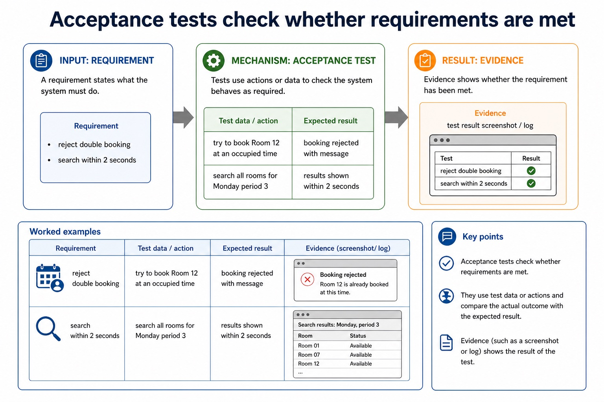

# Lesson 085: Testing methods through the development process

**Course:** Cambridge International AS Level Computer Science 9618, 2027-2029 Version 2 
**Paper:** Paper 2 
**Syllabus:** Section 12: Software development 
**Syllabus requirements:** S12.05 
**Pacing:** Flexible. Select the material set and practice depth needed by the learner.

## Teaching-depth menu

- **Quick route:** Use the diagnostic, learning objectives, first worked example and foundation question. Stop once the learner can explain the central distinction accurately.
- **Full route:** Use every knowledge-point material set, the worked method, the terminology check and all questions.
- **Deep route:** Add the prerequisite refresher, ask learners to connect the concept checklist, discuss the labelled extension and complete a transfer question without a model answer.

## 1. Prerequisite knowledge and quick diagnostic

Recall S12.04 before starting this lesson.

Ask the learner to give one accurate definition or method step before continuing. If they cannot, briefly revisit the named prerequisite rather than repeating the whole previous lesson.

### Optional prerequisite refresher

- Understand different ways of exposing and avoiding faults in a program. Locate and identify syntax, logic and run-time errors in a program and correct identified errors.
- Identify and correct syntax, logic and runtime errors.

## 2. Knowledge explanation

### 1. Walkthrough · White-box · Black-box · Integration (S12.05)

**Concept map:** walkthrough → white-box → black-box → integration → alpha → beta → acceptance → stub → testing

**Three-part explanation:**

1. dry run, walkthrough, white-box, black-box, integration, alpha, beta and acceptance testing, and use of a stub
2. Internal staff perform alpha testing, selected external users perform beta testing, and the customer performs acceptance testing against the agreed lockout behaviour
3. Describe testing methods and select suitable test data

**Concrete cue:** Describe testing methods and select suitable test data: dry run, walkthrough, white-box, black-box, integration, alpha, beta and acceptance testing, and use of a stub.

#### Testing is planned evidence that the system behaves as expected

Text transcript

- Evidence
- Unit testing
- one module or subroutine
- check clash detection function
- actual output compared with expected output
- Integration testing
- modules working together
- booking form sends data to save module

#### Acceptance tests check whether requirements are met

Text transcript

- Acceptance tests
- Requirement
- Test data/action
- Expected result
- Evidence
- reject double booking
- try to book Room 12 at an occupied time
- booking rejected with message

#### Test strategy and test plan are different documents

Text transcript

- A test strategy states the testing levels, methods, responsibilities, sequence and resources for the project.
- A test plan records individual cases with a test ID, purpose, data, expected result, actual result and pass/fail outcome.
- Normal, abnormal and extreme/boundary values are test-data categories; a list of values alone is neither a complete strategy nor a complete test plan.

#### Good testing uses different categories of data

Text transcript

- Test data
- Category
- Room capacity example
- Expected result
- valid typical data
- 24 students for capacity 30
- accepted
- Boundary

#### Design documentation supports implementation, testing and maintenance

Text transcript

- Using design docs later
- Implementation
- Developers know which data fields, algorithms and interface behaviours to build.
- Testers compare actual behaviour with the designed rules, validation and expected messages.
- Maintenance
- Future changes are safer because developers can see existing data rules and processing assumptions.

Precise syllabus wording

Understand dry run, walkthrough, white-box, black-box, integration, alpha, beta, acceptance and stub testing.

Describe testing methods and select suitable test data: dry run, walkthrough, white-box, black-box, integration, alpha, beta and acceptance testing, and use of a stub.

### Supporting diagram library

#### Extreme or boundary data uses valid values at accepted limits

Text transcript

- Extreme/boundary data uses valid values at the accepted lower or upper limit.
- For an accepted mark range of 0 to 100 inclusive, 0 and 100 are valid extreme/boundary values.
- Values just outside the limits, such as -1 and 101, are abnormal and should be rejected.

#### Analyse and amend an existing program

Text transcript

- Analyse the existing program's purpose, inputs, outputs, control flow and behaviour that must remain unchanged before editing it.
- Amend declarations, initialisation, processing and output coherently to add the requested functionality rather than rewriting unrelated code.
- Test the new path and rerun regression tests for the existing path; adding functionality is an enhancement, not merely correcting a fault.

#### Classify input for NumberOfStudents, valid range 1 to 30

Text transcript

- Test data classifier
- Test value

#### Evaluation uses requirements and measurable success criteria

Text transcript

- A success criterion must state a measurable threshold before evidence can be judged against it.
- If 8 of 10 users or 95 of 100 searches is sufficient, state that threshold explicitly.
- Without a threshold, do not label partial evidence as an unqualified criterion met.

#### Implementation turns the design into a working system

Text transcript

- Implementation
- Program modules, create files or databases, implement interfaces and connect components.
- Put the system into the user environment, configure hardware, accounts, permissions and data.
- Document
- Prepare user instructions and technical notes so the system can be used and supported.
- Implementation should follow the design documentation. If implementation silently changes the design, testing may no longer match the intended system.

#### Maintenance changes a system after it has been delivered

Text transcript

- Maintenance
- Corrective
- Fixing faults found after release, such as a booking clash that was not rejected.
- Adaptive
- Changing the system because the environment changes, such as a new timetable structure.
- Perfective
- Improving performance, usability or features, such as faster room search.

#### Which lifecycle stage is being described?

Text transcript

- Interactive stage chooser
- Scenario

Open precise terminology and exam facts

- Describe testing methods and select suitable test data: dry run, walkthrough, white-box, black-box, integration, alpha, beta and acceptance testing, and use of a stub.
- Dry run manually traces code; walkthrough is a structured peer review; white-box derives tests from internal paths; black-box derives tests from specifications. Integration tests combined modules, using a stub to imitate an unavailable called module.
- Alpha testing is performed internally before release; beta testing uses selected external users in realistic settings; acceptance testing checks the delivered system against agreed requirements. A strategy states levels/methods/responsibility, while a test plan records test ID, purpose, data, expected result, actual result and pass/fail.
- Choose test data from the stated validation rule and give an expected result for each value. A label such as 'boundary' is insufficient unless the value really tests a stated limit.
- Every maintenance change requires impact analysis, controlled amendment, tests for the changed behaviour and regression tests for unaffected behaviour. Records should link the request, code change and test evidence.
- Test the enhancement with data that exercises the new path and rerun regression tests for existing paths. Correcting a fault is corrective maintenance; adding or improving requested functionality is an enhancement and may be perfective maintenance.

### Worked example

1. Test login through review, construction, integration and release
2. Test an inclusive mark range
3. Three changes to one booking system
4. Add a Merit count without breaking PassCount
5. First dry-run the lockout counter and conduct a walkthrough in which peers inspect the algorithm.
6. White-box tests cover true/false paths; black-box tests valid, invalid and boundary inputs from requirements.

Beyond syllabus / 延伸知识（不要求背诵）: modern teams often use continuous integration to repeat building and testing whenever a program changes.
## 3. Practice by question type

### Question 1 - foundation - apply - 2 marks

Which method derives tests from source-code paths?

**Answer:** White-box testing.

**Marking guidance:** Award one mark for each distinct, technically accurate point or method step.

**Common error:** For the command word apply, perform that exact action; do not replace it with an unrelated fact.

### Question 2 - application - explain - 8 marks

Explain why a login-system project needs both a test strategy and a test plan. State three likely contents of each document. Suggest normal, abnormal and extreme/boundary data for an integer age accepted from 12 to 18 inclusive, and state each expected result. Identify and justify these changes: fix a save crash; support a new operating-system API; add an export feature. For one change, state the impact-analysis and regression evidence required. An existing program counts PassCount for Marks[1:30] where each mark is at least 50. Analyse where a new MeritCount for marks at least 70 should be added, write the amended declarations, initialisation, loop update and output, and name four boundary-focused test values.

**Answer:** strategy coordinates the overall approach, levels/methods or responsibilities; strategy content such as methods, sequence, responsibility or resources; a second distinct strategy content; plan records individual tests and their evidence; plan content such as test ID, purpose, data or expected result; a second distinct plan content such as actual result or pass/fail; valid normal value; 12 and/or 18 as valid extremes; 11 and/or 19 as abnormal boundary; coherent expected results; save-crash fix classified as corrective with fault reason; new operating-system API classified as adaptive with environment reason; new export feature classified as perfective with enhancement reason; identifies affected interfaces/modules or behaviour before amendment; tests the changed path; reruns relevant existing tests to detect regression; analysis identifies the existing traversal and output that must remain; declares and initialises MeritCount without removing PassCount; increments MeritCount inside the existing traversal when mark is at least 70; preserves the existing pass condition at 50 and outputs both results after the loop; uses 49 and 50 to regression-test the pass boundary; uses 69 and 70 to test the new merit boundary

**Marking guidance:** Do not require candidates to produce either document as a syllabus obligation; assess the need and likely contents. Do not credit a value whose classification contradicts the stated inclusive range. Do not classify every post-release change as adaptive or describe perfective maintenance as fault correction only. Do not accept a rewrite that removes the existing pass count, changes its boundary, or tests only the new feature.

**Common error:** Do not repeat the same point in different words; each mark needs a separate idea or method step.

### Question 3 - transfer - apply - 2 marks

Who normally performs beta testing?

**Answer:** Selected external/end users in realistic use.

**Marking guidance:** Award one mark for each distinct, technically accurate point or method step.

**Common error:** Do not copy the worked example unchanged; transfer the method and check it against the new context.

### Related past-paper indexes

| Reference | Marks | Command word | Question type |
|---|---:|---|---|
| 9618/21/W/24 Q5(a) | 5 | complete | recall |
| 9618/21/W/24 Q5(ii) | 1 | complete | recall |
| 9618/23/S/23 Q5(a) | 3 | explain | explain |

These are indexes only. Cambridge question and mark-scheme wording is not reproduced.

## 4. Summary and exam reminders

### Summary

- Define testing methods through the development process with the exact technical vocabulary expected by the syllabus.
- Use the lesson method on a fresh context and show the intermediate decision, representation or calculation.
- Match the shape of the answer to the command word and the available marks.
- Check the final answer against the scenario instead of repeating a memorised sentence.

### Common error to correct

Students often describe the lifecycle as a fixed checklist. Correction: development is iterative; findings can send a project back to earlier stages.

### Exam technique

- Follow the command word: state gives a fact; explain links a cause to a consequence; compare covers both sides.
- Match the number of independent points or method steps to the available marks.
- For testing methods through the development process, use the exact technical term before applying it to the scenario.
