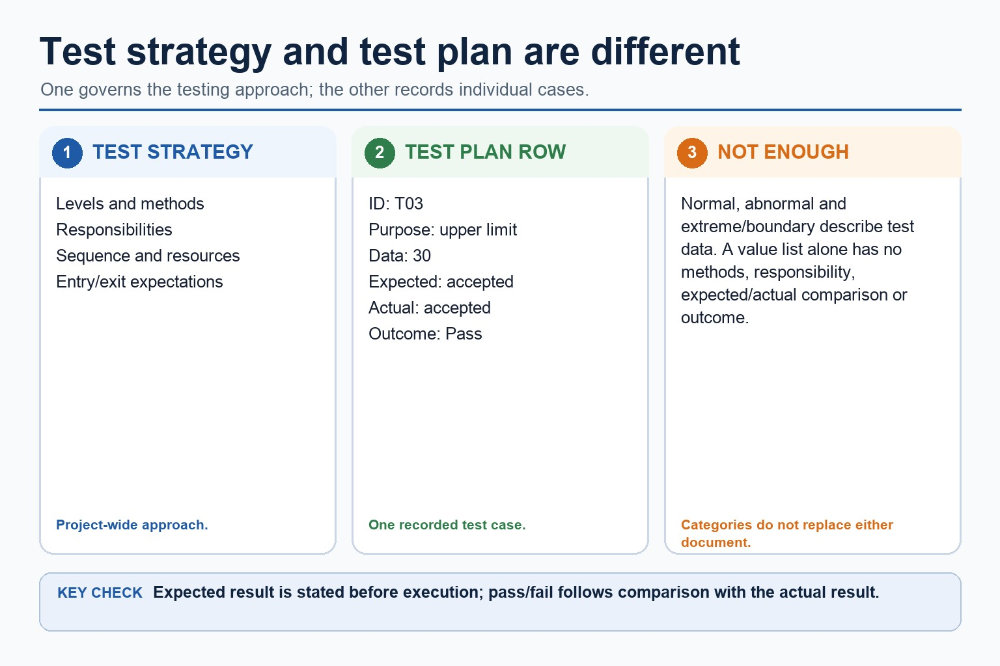
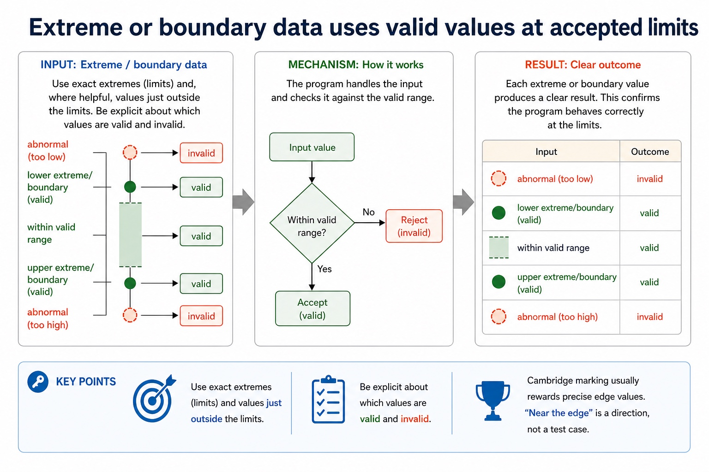
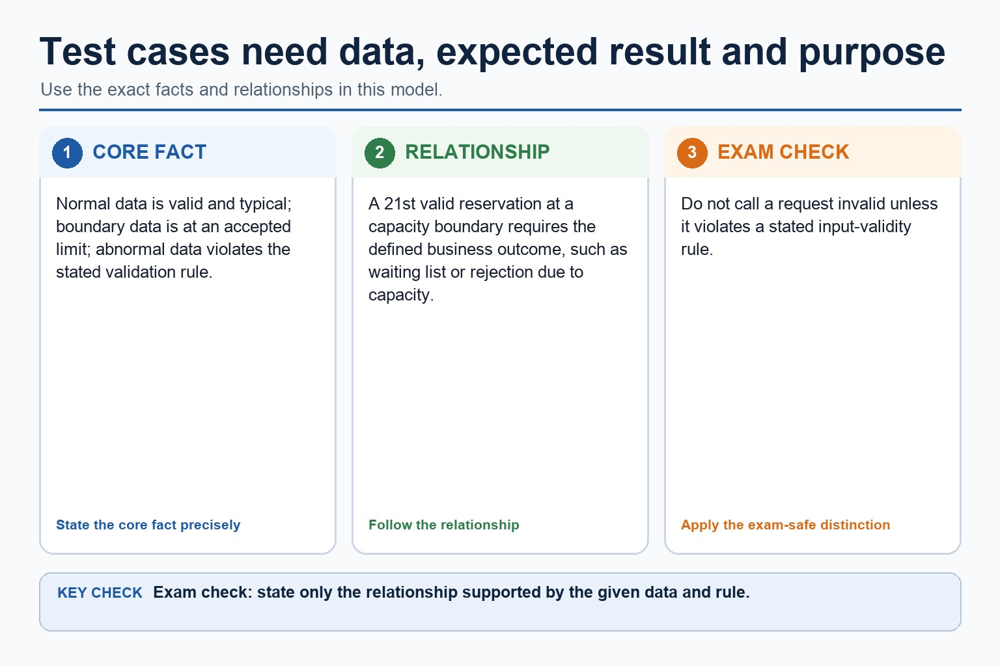
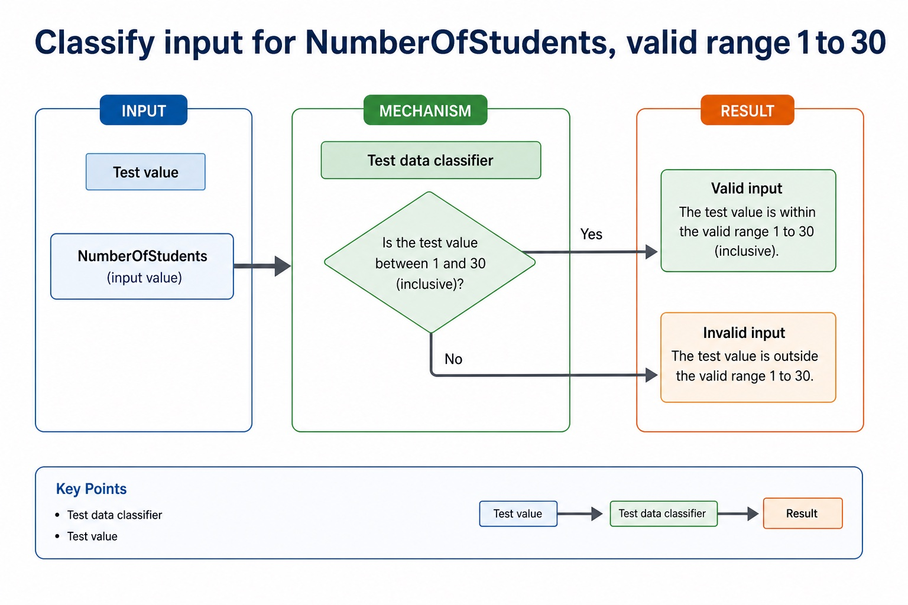
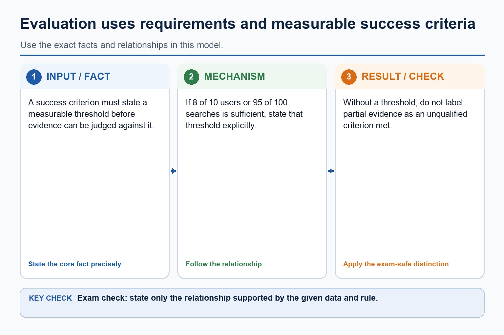
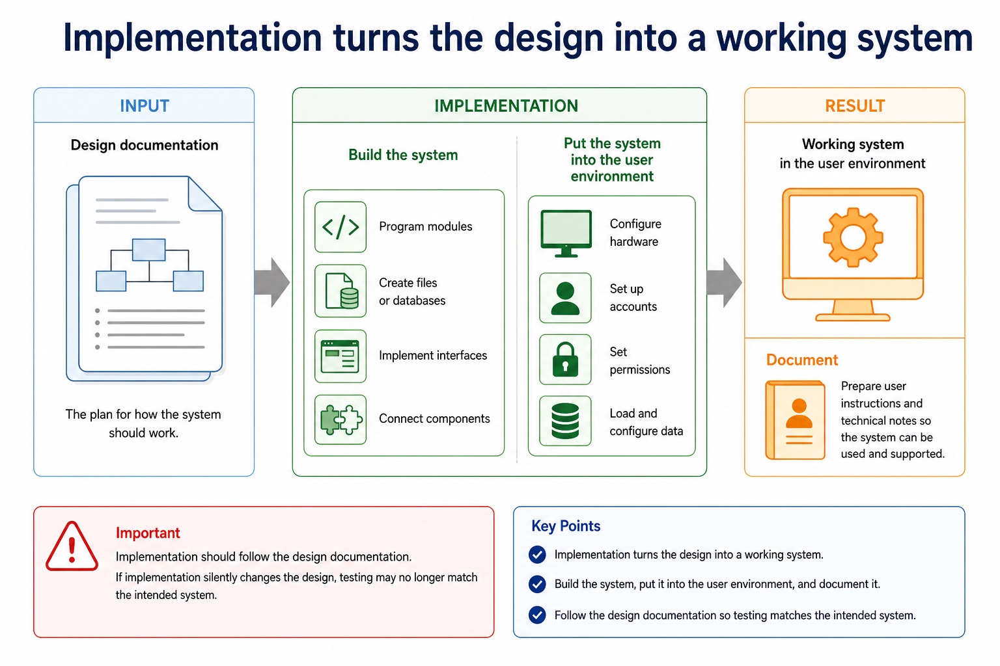
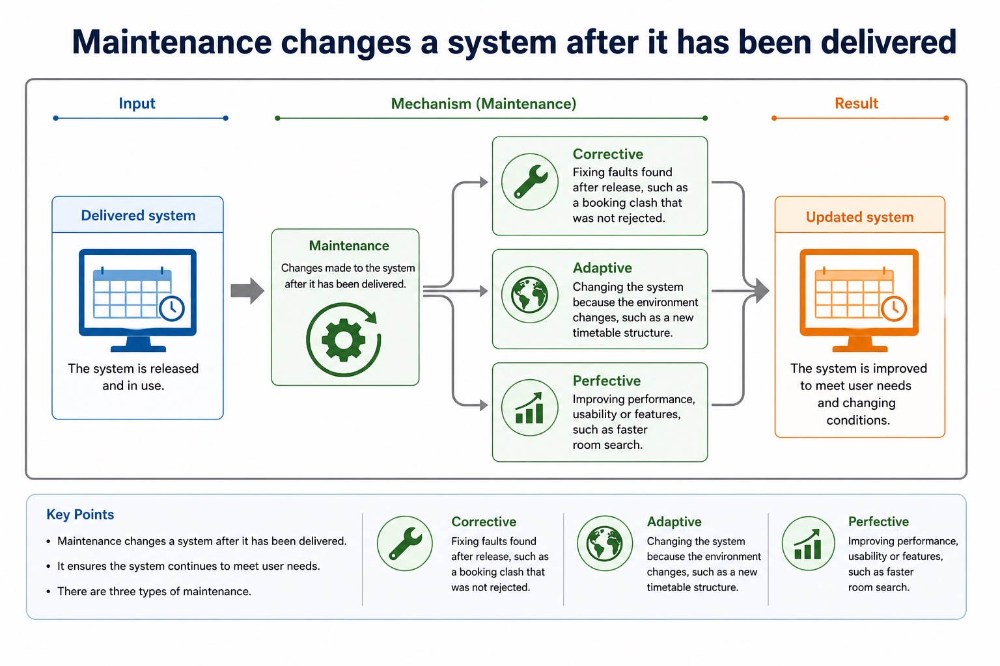
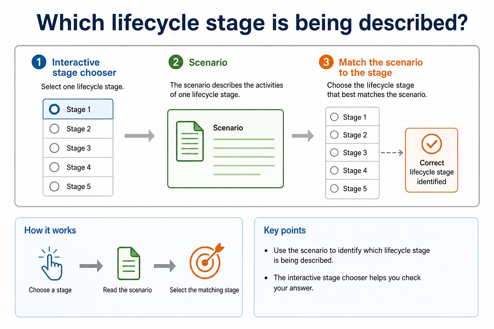
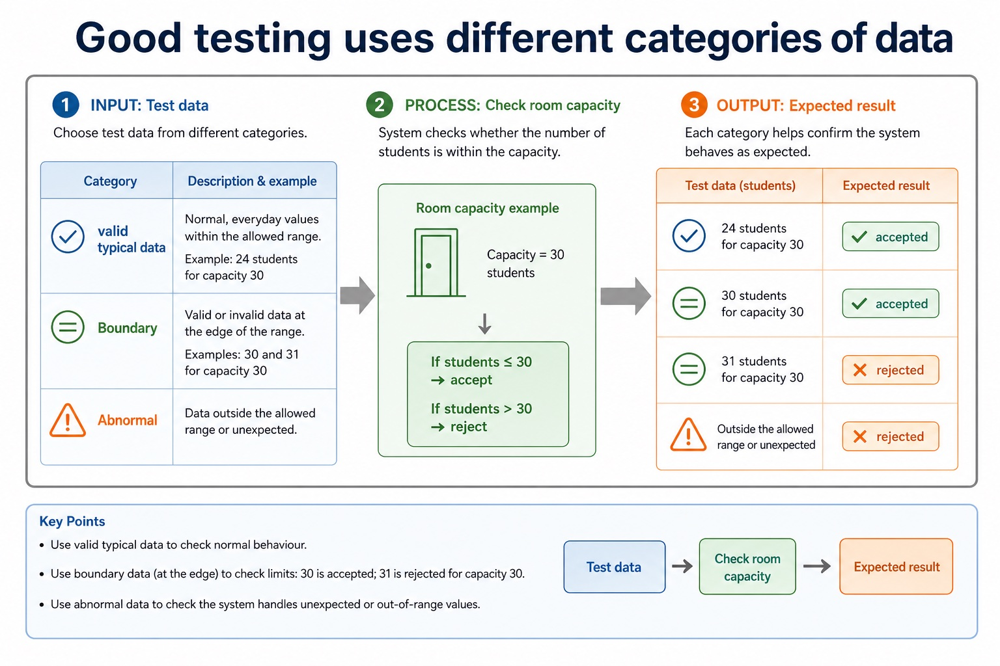

# Lesson 087: Normal, abnormal and boundary test data

**Course:** Cambridge International AS Level Computer Science 9618, 2027-2029 Version 2 
**Paper:** Paper 2 
**Syllabus:** Section 12: Software development 
**Syllabus requirements:** S12.07 
**Pacing:** Flexible. Select the material set and practice depth needed by the learner.

## Teaching-depth menu

- **Quick route:** Use the diagnostic, learning objectives, first worked example and foundation question. Stop once the learner can explain the central distinction accurately.
- **Full route:** Use every knowledge-point material set, the worked method, the terminology check and all questions.
- **Deep route:** Add the prerequisite refresher, ask learners to connect the concept checklist, discuss the labelled extension and complete a transfer question without a model answer.

## 1. Prerequisite knowledge and quick diagnostic

Recall the main conclusion from Lesson 086: Test strategies and test plans.

Ask the learner to give one accurate definition or method step before continuing. If they cannot, briefly revisit the named prerequisite rather than repeating the whole previous lesson.

## 2. Knowledge explanation

### 1. Normal · Abnormal · Extreme (S12.07)

**Concept map:** normal → abnormal → extreme

**Three-part explanation:**

1. Choose suitable test data for a test plan, including normal, abnormal and extreme/boundary data
2. For an allowed mark from 0 to 100 inclusive, 55 is normal, 0 and 100 are valid extreme/boundary values, and -1 or 101 is abnormal
3. values immediately outside a limit are abnormal boundary checks

**Concrete cue:** Choose suitable test data for a test plan, including normal, abnormal and extreme/boundary data.

#### Test strategy and test plan are different documents

Text transcript

- A test strategy states the testing levels, methods, responsibilities, sequence and resources for the project.
- A test plan records individual cases with a test ID, purpose, data, expected result, actual result and pass/fail outcome.
- Normal, abnormal and extreme/boundary values are test-data categories; a list of values alone is neither a complete strategy nor a complete test plan.

#### Extreme or boundary data uses valid values at accepted limits

Text transcript

- Extreme/boundary data uses valid values at the accepted lower or upper limit.
- For an accepted mark range of 0 to 100 inclusive, 0 and 100 are valid extreme/boundary values.
- Values just outside the limits, such as -1 and 101, are abnormal and should be rejected.

#### Test cases need data, expected result and purpose

Text transcript

- Normal data is valid and typical; boundary data is at an accepted limit; abnormal data violates the stated validation rule.
- A 21st valid reservation at a capacity boundary requires the defined business outcome, such as waiting list or rejection due to capacity.
- Do not call a request invalid unless it violates a stated input-validity rule.

Precise syllabus wording

Select normal, abnormal and extreme/boundary test data.

Choose suitable test data for a test plan, including normal, abnormal and extreme/boundary data.

### Supporting diagram library

#### Analyse and amend an existing program

Text transcript

- Analyse the existing program's purpose, inputs, outputs, control flow and behaviour that must remain unchanged before editing it.
- Amend declarations, initialisation, processing and output coherently to add the requested functionality rather than rewriting unrelated code.
- Test the new path and rerun regression tests for the existing path; adding functionality is an enhancement, not merely correcting a fault.

#### Classify input for NumberOfStudents, valid range 1 to 30

Text transcript

- Test data classifier
- Test value

#### Evaluation uses requirements and measurable success criteria

Text transcript

- A success criterion must state a measurable threshold before evidence can be judged against it.
- If 8 of 10 users or 95 of 100 searches is sufficient, state that threshold explicitly.
- Without a threshold, do not label partial evidence as an unqualified criterion met.

#### Implementation turns the design into a working system

Text transcript

- Implementation
- Program modules, create files or databases, implement interfaces and connect components.
- Put the system into the user environment, configure hardware, accounts, permissions and data.
- Document
- Prepare user instructions and technical notes so the system can be used and supported.
- Implementation should follow the design documentation. If implementation silently changes the design, testing may no longer match the intended system.

#### Maintenance changes a system after it has been delivered

Text transcript

- Maintenance
- Corrective
- Fixing faults found after release, such as a booking clash that was not rejected.
- Adaptive
- Changing the system because the environment changes, such as a new timetable structure.
- Perfective
- Improving performance, usability or features, such as faster room search.

#### Which lifecycle stage is being described?

Text transcript

- Interactive stage chooser
- Scenario

#### Good testing uses different categories of data

Text transcript

- Test data
- Category
- Room capacity example
- Expected result
- valid typical data
- 24 students for capacity 30
- accepted
- Boundary

#### Testing is planned evidence that the system behaves as expected

Text transcript

- Evidence
- Unit testing
- one module or subroutine
- check clash detection function
- actual output compared with expected output
- Integration testing
- modules working together
- booking form sends data to save module

Open precise terminology and exam facts

- Choose suitable test data for a test plan, including normal, abnormal and extreme/boundary data.
- Alpha testing is performed internally before release; beta testing uses selected external users in realistic settings; acceptance testing checks the delivered system against agreed requirements. A strategy states levels/methods/responsibility, while a test plan records test ID, purpose, data, expected result, actual result and pass/fail.
- Normal data are valid values within the accepted range. Abnormal data are invalid and should be rejected. Extreme or boundary data are valid values at the limits of the accepted range; values immediately outside a limit are abnormal boundary checks.
- Choose test data from the stated validation rule and give an expected result for each value. A label such as 'boundary' is insufficient unless the value really tests a stated limit.
- Every maintenance change requires impact analysis, controlled amendment, tests for the changed behaviour and regression tests for unaffected behaviour. Records should link the request, code change and test evidence.
- Test the enhancement with data that exercises the new path and rerun regression tests for existing paths. Correcting a fault is corrective maintenance; adding or improving requested functionality is an enhancement and may be perfective maintenance.

### Worked example

1. Test login through review, construction, integration and release
2. Test an inclusive mark range
3. Three changes to one booking system
4. Add a Merit count without breaking PassCount
5. First dry-run the lockout counter and conduct a walkthrough in which peers inspect the algorithm.
6. White-box tests cover true/false paths; black-box tests valid, invalid and boundary inputs from requirements.

Beyond syllabus / 延伸知识（不要求背诵）: modern teams often use continuous integration to repeat building and testing whenever a program changes.
## 3. Practice by question type

### Question 1 - foundation - give - 2 marks

Give one abnormal boundary value.

**Answer:** -1 or 101.

**Marking guidance:** Award one mark for each distinct, technically accurate point or method step.

**Common error:** For the command word give, perform that exact action; do not replace it with an unrelated fact.

### Question 2 - application - give - 2 marks

Give one normal mark for 0 to 100 inclusive.

**Answer:** Any valid non-boundary value, for example 55.

**Marking guidance:** Award one mark for each distinct, technically accurate point or method step.

**Common error:** Do not repeat the same point in different words; each mark needs a separate idea or method step.

### Question 3 - transfer - explain - 3 marks

Explain how normal, abnormal and boundary test data would be applied in a suitable computing context.

**Answer:** Alpha testing is performed internally before release; beta testing uses selected external users in realistic settings; acceptance testing checks the delivered system against agreed requirements. A strategy states levels/methods/responsibility, while a test plan records test ID, purpose, data, expected result, actual result and pass/fail. Normal data are valid values within the accepted range. Abnormal data are invalid and should be rejected. Extreme or boundary data are valid values at the limits of the accepted range; values immediately outside a limit are abnormal boundary checks. Choose test data from the stated validation rule and give an expected result for each value. A label such as 'boundary' is insufficient unless the value really tests a stated limit.

**Marking guidance:** Each mark needs a relevant point linked to the stated context.

**Common error:** Do not copy the worked example unchanged; transfer the method and check it against the new context.

## 4. Summary and exam reminders

### Summary

- Define normal, abnormal and boundary test data with the exact technical vocabulary expected by the syllabus.
- Use the lesson method on a fresh context and show the intermediate decision, representation or calculation.
- Match the shape of the answer to the command word and the available marks.
- Check the final answer against the scenario instead of repeating a memorised sentence.

### Common error to correct

Students often describe the lifecycle as a fixed checklist. Correction: development is iterative; findings can send a project back to earlier stages.

### Exam technique

- Follow the command word: state gives a fact; explain links a cause to a consequence; compare covers both sides.
- Match the number of independent points or method steps to the available marks.
- For normal, abnormal and boundary test data, use the exact technical term before applying it to the scenario.
