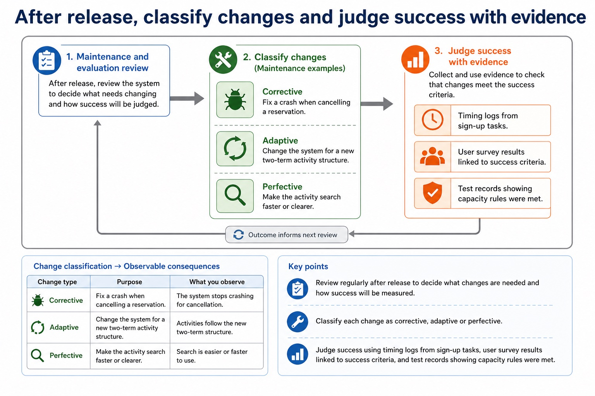
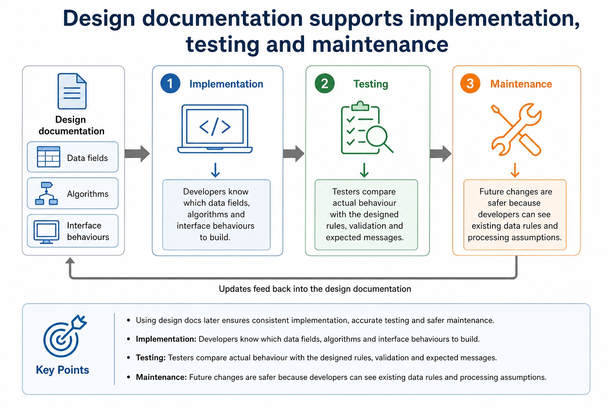

# Lesson 088: Corrective, adaptive and perfective maintenance

**Course:** Cambridge International AS Level Computer Science 9618, 2027-2029 Version 2 
**Paper:** Paper 2 
**Syllabus:** Section 12: Software development 
**Syllabus requirements:** S12.08 
**Pacing:** Flexible. Select the material set and practice depth needed by the learner.

## Teaching-depth menu

- **Quick route:** Use the diagnostic, learning objectives, first worked example and foundation question. Stop once the learner can explain the central distinction accurately.
- **Full route:** Use every knowledge-point material set, the worked method, the terminology check and all questions.
- **Deep route:** Add the prerequisite refresher, ask learners to connect the concept checklist, discuss the labelled extension and complete a transfer question without a model answer.

## 1. Prerequisite knowledge and quick diagnostic

Recall S12.01 before starting this lesson.

Ask the learner to give one accurate definition or method step before continuing. If they cannot, briefly revisit the named prerequisite rather than repeating the whole previous lesson.

### Optional prerequisite refresher

- Candidates should understand the purpose of a program-development lifecycle and the need for different lifecycles depending on the program being developed. Compare the principles, benefits and drawbacks of waterfall, iterative and Rapid Application Development (RAD). Lifecycle stages are analysis, design, coding, testing and maintenance.
- Understand why a program-development lifecycle is used; compare waterfall, iterative and RAD models and their stages.

## 2. Knowledge explanation

### 1. Perfective · Adaptive · Corrective · Maintenance (S12.08)

**Concept map:** perfective → adaptive → corrective → maintenance

**Three-part explanation:**

1. Understand the need for continuing maintenance of a program and the differences between perfective, adaptive and corrective maintenance
2. The same module could receive a corrective change for a crash, an adaptive change for a new operating-system interface, or a perfective change for faster search…
3. Correcting a fault is corrective maintenance

**Concrete cue:** Understand the need for continuing maintenance of a program and the differences between perfective, adaptive and corrective maintenance.

#### Maintenance changes a system after it has been delivered

Text transcript

- Maintenance
- Corrective
- Fixing faults found after release, such as a booking clash that was not rejected.
- Adaptive
- Changing the system because the environment changes, such as a new timetable structure.
- Perfective
- Improving performance, usability or features, such as faster room search.

#### After release, classify changes and judge success with evidence

Text transcript

- Maintenance and evaluation review
- Maintenance examples
- Corrective: fix a crash when cancelling a reservation.
- Adaptive: change the system for a new two-term activity structure.
- Perfective: make the activity search faster or clearer.
- Evaluation evidence
- Timing logs from sign-up tasks.
- User survey results linked to success criteria.

#### Design documentation supports implementation, testing and maintenance

Text transcript

- Using design docs later
- Implementation
- Developers know which data fields, algorithms and interface behaviours to build.
- Testers compare actual behaviour with the designed rules, validation and expected messages.
- Maintenance
- Future changes are safer because developers can see existing data rules and processing assumptions.

Precise syllabus wording

Understand perfective, adaptive and corrective maintenance.

Understand the need for continuing maintenance of a program and the differences between perfective, adaptive and corrective maintenance.

### Supporting diagram library

#### Extreme or boundary data uses valid values at accepted limits

Text transcript

- Extreme/boundary data uses valid values at the accepted lower or upper limit.
- For an accepted mark range of 0 to 100 inclusive, 0 and 100 are valid extreme/boundary values.
- Values just outside the limits, such as -1 and 101, are abnormal and should be rejected.

#### Analyse and amend an existing program

Text transcript

- Analyse the existing program's purpose, inputs, outputs, control flow and behaviour that must remain unchanged before editing it.
- Amend declarations, initialisation, processing and output coherently to add the requested functionality rather than rewriting unrelated code.
- Test the new path and rerun regression tests for the existing path; adding functionality is an enhancement, not merely correcting a fault.

#### Test strategy and test plan are different documents

Text transcript

- A test strategy states the testing levels, methods, responsibilities, sequence and resources for the project.
- A test plan records individual cases with a test ID, purpose, data, expected result, actual result and pass/fail outcome.
- Normal, abnormal and extreme/boundary values are test-data categories; a list of values alone is neither a complete strategy nor a complete test plan.

#### Classify input for NumberOfStudents, valid range 1 to 30

Text transcript

- Test data classifier
- Test value

#### Evaluation uses requirements and measurable success criteria

Text transcript

- A success criterion must state a measurable threshold before evidence can be judged against it.
- If 8 of 10 users or 95 of 100 searches is sufficient, state that threshold explicitly.
- Without a threshold, do not label partial evidence as an unqualified criterion met.

#### Implementation turns the design into a working system

Text transcript

- Implementation
- Program modules, create files or databases, implement interfaces and connect components.
- Put the system into the user environment, configure hardware, accounts, permissions and data.
- Document
- Prepare user instructions and technical notes so the system can be used and supported.
- Implementation should follow the design documentation. If implementation silently changes the design, testing may no longer match the intended system.

#### Which lifecycle stage is being described?

Text transcript

- Interactive stage chooser
- Scenario

#### Good testing uses different categories of data

Text transcript

- Test data
- Category
- Room capacity example
- Expected result
- valid typical data
- 24 students for capacity 30
- accepted
- Boundary

#### Testing is planned evidence that the system behaves as expected

Text transcript

- Evidence
- Unit testing
- one module or subroutine
- check clash detection function
- actual output compared with expected output
- Integration testing
- modules working together
- booking form sends data to save module

Open precise terminology and exam facts

- Understand the need for continuing maintenance of a program and the differences between perfective, adaptive and corrective maintenance.
- Maintenance continues after delivery because faults are discovered, operating environments and rules change, and users request improvements. Corrective maintenance fixes faults in required behaviour; adaptive maintenance changes software for a new environment, platform, law or external rule; perfective maintenance improves functionality, usability, performance or maintainability.
- Classify the reason for the change, not the code edited. The same module could receive a corrective change for a crash, an adaptive change for a new operating-system interface, or a perfective change for faster search and a clearer result display.
- Every maintenance change requires impact analysis, controlled amendment, tests for the changed behaviour and regression tests for unaffected behaviour. Records should link the request, code change and test evidence.
- Analyse the supplied program before editing it: state its current purpose, inputs, outputs, data structures, control flow and assumptions. Trace representative data to identify where a new requirement belongs and record behaviour that must remain unchanged.
- Amend the existing program with the smallest coherent change that enhances functionality. Update related declarations, initialisation, processing and output together; preserve established interfaces unless the requirement needs an interface change; and keep Cambridge pseudocode constructs complete.
- Test the enhancement with data that exercises the new path and rerun regression tests for existing paths. Correcting a fault is corrective maintenance; adding or improving requested functionality is an enhancement and may be perfective maintenance.

### Worked example

1. Test login through review, construction, integration and release
2. Test an inclusive mark range
3. Three changes to one booking system
4. Add a Merit count without breaking PassCount
5. First dry-run the lockout counter and conduct a walkthrough in which peers inspect the algorithm.
6. White-box tests cover true/false paths; black-box tests valid, invalid and boundary inputs from requirements.

Beyond syllabus / 延伸知识（不要求背诵）: modern teams often use continuous integration to repeat building and testing whenever a program changes.
## 3. Practice by question type

### Question 1 - foundation - apply - 2 marks

Which type changes software for a new external rule?

**Answer:** Adaptive maintenance.

**Marking guidance:** Award one mark for each distinct, technically accurate point or method step.

**Common error:** For the command word apply, perform that exact action; do not replace it with an unrelated fact.

### Question 2 - application - explain - 2 marks

Why does maintenance continue after acceptance?

**Answer:** Faults, environmental changes and requested improvements continue after delivery.

**Marking guidance:** Award one mark for each distinct, technically accurate point or method step.

**Common error:** Do not repeat the same point in different words; each mark needs a separate idea or method step.

### Question 3 - transfer - state - 2 marks

State two precise facts about corrective, adaptive and perfective maintenance.

**Answer:** Understand the need for continuing maintenance of a program and the differences between perfective, adaptive and corrective maintenance. Maintenance continues after delivery because faults are discovered, operating environments and rules change, and users request improvements. Corrective maintenance fixes faults in required behaviour; adaptive maintenance changes software for a new environment, platform, law or external rule; perfective maintenance improves functionality, usability, performance or maintainability.

**Marking guidance:** Award one mark for each distinct fact; do not credit a repeated point.

**Common error:** Do not copy the worked example unchanged; transfer the method and check it against the new context.

## 4. Summary and exam reminders

### Summary

- Define corrective, adaptive and perfective maintenance with the exact technical vocabulary expected by the syllabus.
- Use the lesson method on a fresh context and show the intermediate decision, representation or calculation.
- Match the shape of the answer to the command word and the available marks.
- Check the final answer against the scenario instead of repeating a memorised sentence.

### Common error to correct

Students often describe the lifecycle as a fixed checklist. Correction: development is iterative; findings can send a project back to earlier stages.

### Exam technique

- Follow the command word: state gives a fact; explain links a cause to a consequence; compare covers both sides.
- Match the number of independent points or method steps to the available marks.
- For corrective, adaptive and perfective maintenance, use the exact technical term before applying it to the scenario.
