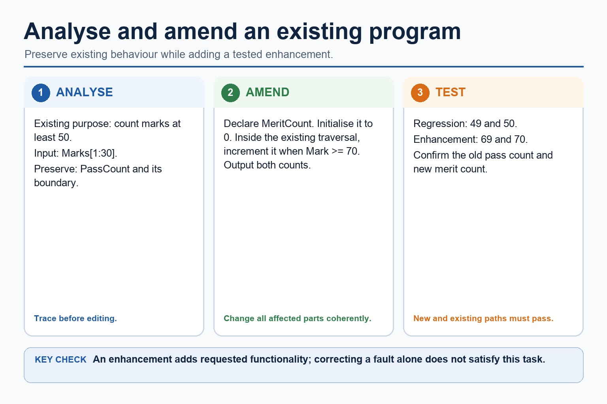

# Lesson 089: Analysing and amending an existing program

**Course:** Cambridge International AS Level Computer Science 9618, syllabus for examination in 2027-2029 
**Paper:** Paper 2 
**Syllabus:** Section 12: Software development 
**Syllabus requirements:** S12.09 
**Pacing:** Flexible. Select a quick, full or deep route for the learners in front of you.

## Teaching-depth menu

- **Quick route:** Use the diagnostic, learning objectives, first worked example and foundation question. Stop once the learner can explain the central distinction accurately.
- **Full route:** Teach every knowledge-point material set, the worked method and all lesson questions.
- **Deep route:** Add the prerequisite refresher, ask learners to connect the concept checklist, discuss the labelled extension and complete a transfer question without a model answer.

## 1. Prerequisite knowledge and quick diagnostic

Recall S12.04 before starting this lesson.

Ask the learner to give one accurate definition or method step before continuing. If they cannot, briefly revisit the named prerequisite rather than repeating the whole previous lesson.

### Optional prerequisite refresher

- Understand different ways of exposing and avoiding faults in a program. Locate and identify syntax, logic and run-time errors in a program and correct identified errors.
- Identify and correct syntax, logic and runtime errors.

## 2. Knowledge explanation

### 1. Analyse and amend an existing program (S12.09)

**Atomic learning targets**

- **S12.09.A01:** analyse / analyze
- **S12.09.A02:** amend
- **S12.09.A03:** existing
- **S12.09.A04:** program

**Core explanation**

- Analyse the supplied program before editing it: state its current purpose, inputs, outputs, data structures, control flow and assumptions. Trace representative data to identify where a new requirement belongs and record behaviour that must remain unchanged.
- Amend the existing program with the smallest coherent change that enhances functionality. Update related declarations, initialisation, processing and output together; preserve established interfaces unless the requirement needs an interface change; and keep Cambridge pseudocode constructs complete.
- Test the enhancement with data that exercises the new path and rerun regression tests for existing paths. Correcting a fault is corrective maintenance; adding or improving requested functionality is an enhancement and may be perfective maintenance.
- Amend the existing program with the smallest coherent change that enhances functionality.

**Mechanism or method**

1. **Identify the relevant condition or input** — Analyse the supplied program before editing it: state its current purpose, inputs, outputs, data structures, control flow and assumptions.
2. **Trace how the process works** — Trace representative data to identify where a new requirement belongs and record behaviour that must remain unchanged.
3. **Connect the mechanism to its result** — Amend the existing program with the smallest coherent change that enhances functionality.

#### Worked example: Analyse and amend an existing program: complete worked route

1. **Identify the relevant condition or input**

Analyse the supplied program before editing it: state its current purpose, inputs, outputs, data structures, control flow and assumptions.

2. **Trace how the process works**

Trace representative data to identify where a new requirement belongs and record behaviour that must remain unchanged.

3. **Connect the mechanism to its result**

Amend the existing program with the smallest coherent change that enhances functionality.

4. **Complete example**

Maintenance continues after delivery because faults are discovered, operating environments and rules change, and users request improvements. Corrective maintenance fixes faults in required behaviour; adaptive maintenance changes software for a new environment, platform, law or external rule; perfective maintenance improves functionality, usability, performance or maintainability.

**Misconceptions to correct**

- Students often describe the lifecycle as a fixed checklist. Correction: development is iterative; findings can send a project back to earlier stages.

#### Mastery check (MC-L089-S12.09)

Explain the following targets in one connected answer, using a concrete example for each: analyse / analyze; amend; existing; program.

Answer criteria

- Analyse the supplied program before editing it: state its current purpose, inputs, outputs, data structures, control flow and assumptions. Trace representative data to identify where a new requirement belongs and record behaviour that must remain unchanged.
- Amend the existing program with the smallest coherent change that enhances functionality. Update related declarations, initialisation, processing and output together; preserve established interfaces unless the requirement needs an interface change; and keep Cambridge pseudocode constructs complete.
- Test the enhancement with data that exercises the new path and rerun regression tests for existing paths. Correcting a fault is corrective maintenance; adding or improving requested functionality is an enhancement and may be perfective maintenance.
- Amend the existing program with the smallest coherent change that enhances functionality.

**Supplementary concept map**

- **Analyse:** Trace purpose inputs and outputs
- **Locate:** Find the responsible code
- **Amend:** Make the smallest coherent change
- **Retest:** Check the changed behaviour
- **Regression:** Confirm unaffected behaviour remains correct
- **existing:** Analyse and amend an existing program.

**Supplementary three-step recap**

1. **Translate the stated design** — Analyse and amend an existing program.
2. **Apply one complete operation** — Analyse an existing program and make amendments to enhance functionality.
3. **Trace state and boundaries** — Amend the existing program with the smallest coherent change that enhances functionality.

**Analyse and amend an existing program:** Analyse the existing program's purpose, inputs, outputs, control flow and behaviour that must remain unchanged before editing it. Amend declarations, initialisation, processing and output coherently to add the requested functionality rather than rewriting unrelated…

#### Analyse and amend an existing program

Text transcript

- Analyse the existing program's purpose, inputs, outputs, control flow and behaviour that must remain unchanged before editing it.
- Amend declarations, initialisation, processing and output coherently to add the requested functionality rather than rewriting unrelated code.
- Test the new path and rerun regression tests for the existing path; adding functionality is an enhancement, not merely correcting a fault.

Precise syllabus wording

Analyse and amend an existing program.

Analyse an existing program and make amendments to enhance functionality.

### Lesson technical reference

- Analyse an existing program and make amendments to enhance functionality.
- Maintenance continues after delivery because faults are discovered, operating environments and rules change, and users request improvements. Corrective maintenance fixes faults in required behaviour; adaptive maintenance changes software for a new environment, platform, law or external rule; perfective maintenance improves functionality, usability, performance or maintainability.
- Analyse the supplied program before editing it: state its current purpose, inputs, outputs, data structures, control flow and assumptions. Trace representative data to identify where a new requirement belongs and record behaviour that must remain unchanged.
- Amend the existing program with the smallest coherent change that enhances functionality. Update related declarations, initialisation, processing and output together; preserve established interfaces unless the requirement needs an interface change; and keep Cambridge pseudocode constructs complete.
- Test the enhancement with data that exercises the new path and rerun regression tests for existing paths. Correcting a fault is corrective maintenance; adding or improving requested functionality is an enhancement and may be perfective maintenance.

Beyond syllabus / 延伸知识（不要求背诵）: modern teams often use continuous integration to repeat building and testing whenever a program changes.
## 3. Practice by question type

### Question 1 - foundation - apply - 2 marks

What should be recorded before changing existing code?

**Answer:** Its purpose, inputs, outputs, relevant control/data flow, assumptions and behaviour that must remain unchanged.

**Marking guidance:** Award one mark for each distinct, technically accurate point or method step.

**Common error:** For the command word apply, perform that exact action; do not replace it with an unrelated fact.

### Question 2 - application - explain - 2 marks

Why rerun old tests after adding a feature?

**Answer:** Regression tests check that the amendment has not broken existing behaviour.

**Marking guidance:** Award one mark for each distinct, technically accurate point or method step.

**Common error:** Do not repeat the same point in different words; each mark needs a separate idea or method step.

### Question 3 - transfer - apply - 2 marks

Which type adds useful functionality or improves performance?

**Answer:** Perfective maintenance.

**Marking guidance:** Award one mark for each distinct, technically accurate point or method step.

**Common error:** Do not copy the worked example unchanged; transfer the method and check it against the new context.

## 4. Summary and exam reminders

### Summary

- S12.09: explain analyse / analyze, amend, existing, program.
- S12.09 method: Identify the relevant condition or input → Trace how the process works → Connect the mechanism to its result.
- Correction to remember: Students often describe the lifecycle as a fixed checklist. Correction: development is iterative; findings can send a project back to earlier stages.

### Common error to correct

Students often describe the lifecycle as a fixed checklist. Correction: development is iterative; findings can send a project back to earlier stages.

### Exam technique

- Follow the command word: state gives a fact; explain links a cause to a consequence; compare covers both sides.
- Match the number of independent points or method steps to the available marks.
- For analysing and amending an existing program, use the exact technical term before applying it to the scenario.
