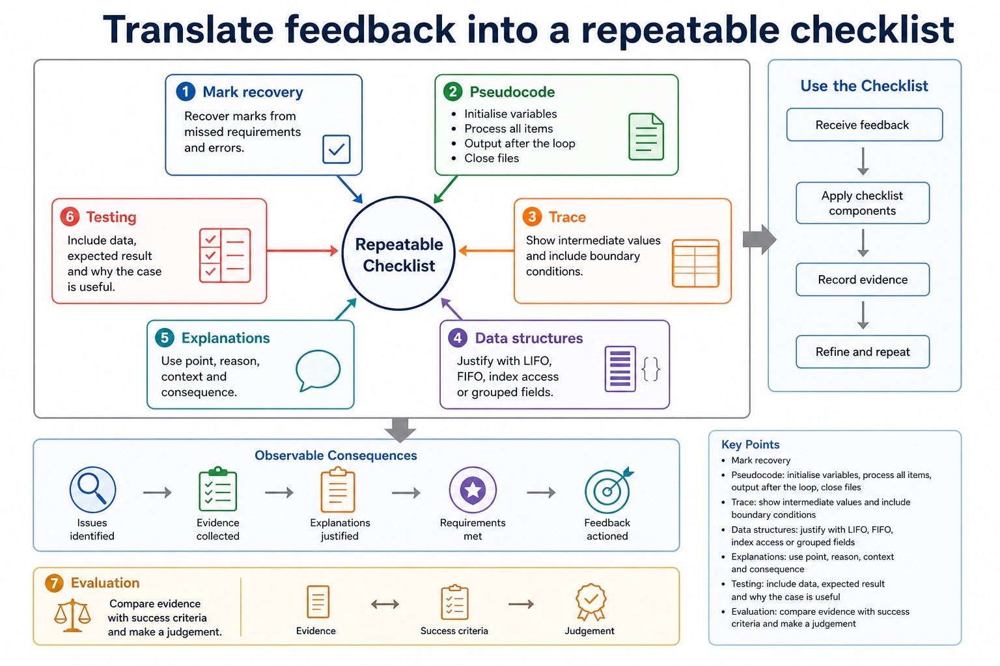

# Lesson 090: Paper 2 integrated review and pseudocode clinic

**Course:** Cambridge International AS Level Computer Science 9618, 2027-2029 Version 2 
**Paper:** Paper 2 
**Syllabus:** Paper 2 integrated review 
**Syllabus requirements:** S9.01, S9.02, S9.03, S9.04, S9.05, S9.06, S9.07, S9.08, S9.09, S10.01, S10.02, S10.03, S10.04, S10.05, S10.06, S10.07, S10.08, S10.09, S10.10, S11.01, S11.02, S11.03, S11.04, S11.05, S11.06, S11.07, S11.08, S11.09, S12.01, S12.02, S12.03, S12.04, S12.05, S12.06, S12.07, S12.08, S12.09 
**Pacing:** Flexible. This lesson is deliberately over-complete; select a quick, full or deep route for the learners in front of you.

## Teaching-depth menu

- **Quick route:** Use the diagnostic, learning objectives, first worked example and foundation question. Stop once the learner can explain the central distinction accurately.
- **Full route:** Teach every core explanation point, the worked example and all lesson questions. Use the visual only when it adds a different representation.
- **Deep route:** Add the prerequisite refresher, ask learners to connect the concept checklist, discuss the labelled extension and complete a transfer question without a model answer.

## 1. Prerequisite knowledge and quick diagnostic

Recall S9.01, S9.03, S9.04, S9.06, S9.02, S10.01, S10.03, S10.08, S10.09, S9.07, S11.04, S11.02, S11.06, S11.07, S12.04, S12.05, S12.01 before starting this lesson.

Ask the learner to give one accurate definition or method step before continuing. If they cannot, briefly revisit the named prerequisite rather than repeating the whole previous lesson.

### Optional prerequisite refresher

- Abstraction is required both as a concept and as a practical modelling skill: explain its need and benefits, then produce an abstract model containing only details essential to the problem.
- Understand abstraction, its purpose/benefits and creation of an abstract model.
- An algorithm is a solution to a problem expressed as a sequence of defined steps; the definition requires both the problem-solving purpose and the defined sequence.
- Understand what an algorithm is.
- Students must choose suitable meaningful identifier names and construct an identifier table that records each identifier's name, data type and purpose for the designed algorithm.
- Choose meaningful identifier names and construct an identifier table.

## 2. Knowledge explanation

### Learning objectives

- Understand abstraction, its purpose/benefits and creation of an abstract model.
- Use decomposition and express a problem as modules.
- Understand what an algorithm is.

### Concept checklist for teacher choice

- abstraction
- essential details
- irrelevant detail
- abstract model
- decomposition
- problem
- modules
- procedure
- function
- algorithm
- solution
- sequence
- defined steps
- meaningful
- identifier
- names
- table
- input-process-output
- design
- pseudocode
- selection
- iteration
- structured
- English

### Detailed explanation

- Use stepwise refinement to develop an algorithm from a high-level solution to a level of detail from which a program can be written; each level must preserve the parent purpose.
- Select and use appropriate types for a problem solution. The Version 2 Notes name integer, real, char, string, Boolean and date, and require the Cambridge pseudocode type names INTEGER, REAL, CHAR, STRING, BOOLEAN, DATE, ARRAY and FILE.
- Define and use a procedure; explain when the use of a procedure is appropriate; use parameters with none, one or more values passed by reference or by value.
- Candidates should understand the purpose of a program-development lifecycle and the need for different lifecycles depending on the program being developed. Compare the principles, benefits and drawbacks of waterfall, iterative and Rapid Application Development (RAD). Lifecycle stages are analysis, design, coding, testing and maintenance.

### Worked example

Use one fresh scenario to apply paper 2 integrated review and pseudocode clinic, showing each decision or calculation step and checking the result against the question context.

Beyond syllabus / 延伸知识（不要求背诵）: modern teams often use continuous integration to repeat building and testing whenever a program changes.

### Retained visual explanation

_Translate feedback into a repeatable checklist. The image and mobile text alternative come from one maintained fact source._

## 3. Practice by question type

### Question 1 - foundation - write - 8 marks

Write Cambridge pseudocode for a linear search of Name[1:20] and an ascending bubble sort of Score[1:20].

**Answer:** linear search initialises Found and Index; linear search loops within indexes 1 to 20 until found or exhausted; linear search compares Name[Index] with the target and records a match; bubble sort uses repeated passes; compares adjacent Score[Index] and Score[Index + 1] within valid bounds; uses Temp or an equivalent safe three-step swap; reduces the unsorted range or uses a valid no-swap stopping condition; all constructs close coherently in Cambridge pseudocode

**Marking guidance:** Do not award only a trace or a description; both requested algorithms must be written and must not access Index + 1 beyond the upper bound.

**Common error:** For the command word write, perform that exact action; do not replace it with an unrelated fact.

### Question 2 - application - explain - 3 marks

Explain one common error from Section 11: Programming, and give the corrected reasoning.

**Answer:** Define and use a procedure; explain when the use of a procedure is appropriate; use parameters with none, one or more values passed by reference or by value.

**Marking guidance:** Credit distinct syllabus-accurate points that follow the command word.

**Common error:** Do not repeat the same point in different words; each mark needs a separate idea or method step.

### Question 3 - application - compare - 4 marks

Compare two closely related ideas from Section 9: Algorithm design and problem-solving.

**Answer:** Use stepwise refinement to develop an algorithm from a high-level solution to a level of detail from which a program can be written; each level must preserve the parent purpose.

**Marking guidance:** Credit distinct syllabus-accurate points that follow the command word.

**Common error:** Do not copy the worked example unchanged; transfer the method and check it against the new context.

### Question 4 - transfer - apply - 4 marks

Apply one method from Section 12: Software development to a fresh exam context.

**Answer:** Candidates should understand the purpose of a program-development lifecycle and the need for different lifecycles depending on the program being developed. Compare the principles, benefits and drawbacks of waterfall, iterative and Rapid Application Development (RAD). Lifecycle stages are analysis, design, coding, testing and maintenance.

**Marking guidance:** Credit distinct syllabus-accurate points that follow the command word.

**Common error:** Do not copy the worked example unchanged; transfer the method and check it against the new context.

### Related past-paper indexes

| Reference | Marks | Command word | Question type |
|---|---:|---|---|
| 9618/21/S/25 Q3 | 8 | write | recall |
| 9618/21/S/25 Q6(b) | 8 | complete | recall |
| 9618/21/S/25 Q7(i) | 8 | write | calculate |
| 9618/21/W/25 Q8(b) | 8 | define | recall |

These are indexes only. Cambridge question and mark-scheme wording is not reproduced.

## 4. Summary and exam reminders

### Summary

- Define paper 2 integrated review and pseudocode clinic with the exact technical vocabulary expected by the syllabus.
- Use the lesson method on a fresh context and show the intermediate decision, representation or calculation.
- Match the shape of the answer to the command word and the available marks.
- Check the final answer against the scenario instead of repeating a memorised sentence.

### Common error to correct

Students often revise by rereading notes only. Correction: review lessons require retrieval, timed practice and correction.

### Exam technique

- Follow the command word: state gives a fact; explain links a cause to a consequence; compare covers both sides.
- Match the number of independent points or method steps to the available marks.
- For paper 2 integrated review and pseudocode clinic, use the exact technical term before applying it to the scenario.

**Optional extra practice:** Correct one answer from a timed attempt and record the exact reason each lost mark was lost.
