# Lesson 090: Paper 2 integrated review and pseudocode clinic

**Course:** Cambridge International AS Level Computer Science 9618, 2027-2029 Version 2 
**Paper:** Paper 2 
**Syllabus:** Paper 2 integrated review 
**Syllabus requirements:** S9.01, S9.02, S9.03, S9.04, S9.05, S9.06, S9.07, S9.08, S9.09, S10.01, S10.02, S10.03, S10.04, S10.05, S10.06, S10.07, S10.08, S10.09, S10.10, S11.01, S11.02, S11.03, S11.04, S11.05, S11.06, S11.07, S11.08, S11.09, S12.01, S12.02, S12.03, S12.04, S12.05, S12.06, S12.07, S12.08, S12.09 
**Pacing:** Flexible. Select the material set and practice depth needed by the learner.

## Teaching-depth menu

- **Quick route:** Use the diagnostic, learning objectives, first worked example and foundation question. Stop once the learner can explain the central distinction accurately.
- **Full route:** Use every knowledge-point material set, the worked method, the terminology check and all questions.
- **Deep route:** Add the prerequisite refresher, ask learners to connect the concept checklist, discuss the labelled extension and complete a transfer question without a model answer.

## 1. Prerequisite knowledge and quick diagnostic

Recall S9.01, S9.03, S9.04, S9.06, S9.02, S10.01, S10.03, S10.08, S10.09, S9.07, S11.04, S11.02, S11.06, S11.07, S12.04, S12.05, S12.01 before starting this lesson.

Ask the learner to give one accurate definition or method step before continuing. If they cannot, briefly revisit the named prerequisite rather than repeating the whole previous lesson.

### Optional prerequisite refresher

- Abstraction is required both as a concept and as a practical modelling skill: explain its need and benefits, then produce an abstract model containing only details essential to the problem.
- Understand abstraction, its purpose/benefits and creation of an abstract model.
- An algorithm is a solution to a problem expressed as a sequence of defined steps; the definition requires both the problem-solving purpose and the defined sequence.
- Understand what an algorithm is.
- Students must choose suitable meaningful identifier names and construct an identifier table that records each identifier's name, data type and purpose for the designed algorithm.
- Choose meaningful identifier names and construct an identifier table.

## 2. Knowledge explanation

### 1. Paper 2 review: algorithm design and data structures (R090.148)

**Concept map:** Paper 2 review: algorithm design and…

**Three-part explanation:**

1. Use the diagrams to retrieve the method, compare similar ideas and correct one typical error
2. Use stepwise refinement to develop an algorithm from a high-level solution to a level of detail from which a program can be written
3. Use one fresh scenario to apply paper 2 integrated review and pseudocode clinic, showing each decision or calculation step and checking the result against the question…

**Concrete cue:** Use one fresh scenario to apply paper 2 integrated review and pseudocode clinic, showing each decision or calculation step and checking the result against the question context.

#### Choose structures by how the data is used

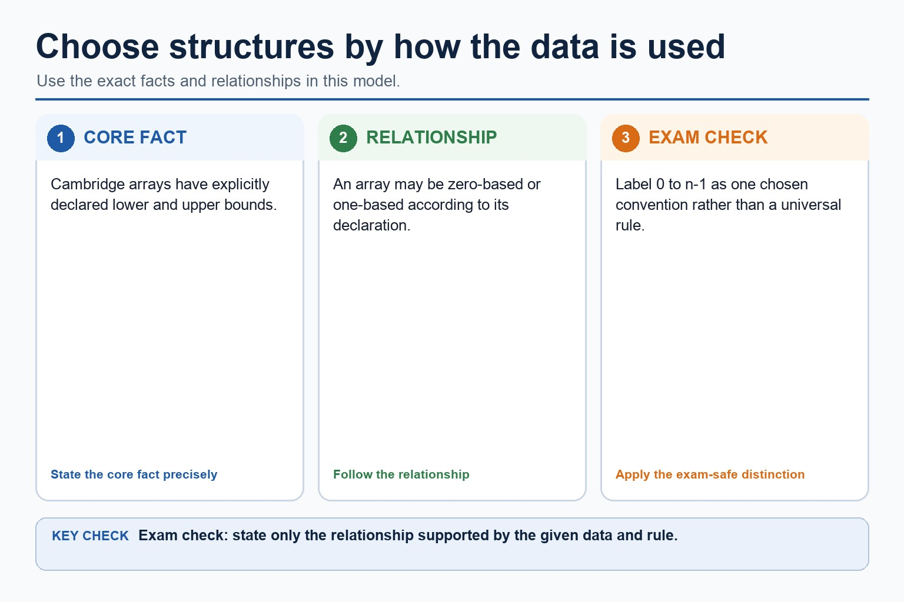

Text transcript

- Cambridge arrays have explicitly declared lower and upper bounds.
- An array may be zero-based or one-based according to its declaration.
- Label 0 to n-1 as one chosen convention rather than a universal rule.

#### Good pseudocode is precise enough to trace

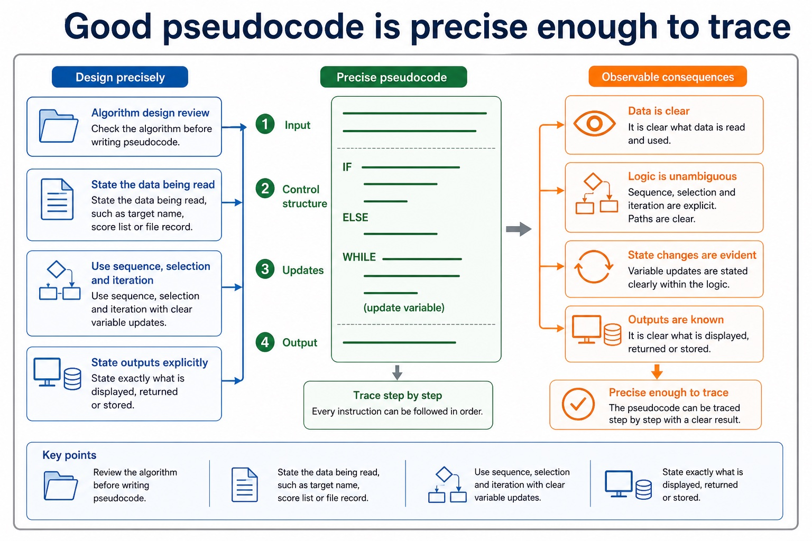

Text transcript

- Algorithm design review
- State the data being read, such as target name, score list or file record.
- Use sequence, selection and iteration with clear variable updates.
- State exactly what is displayed, returned or stored.

#### Persistent data needs clear read/write logic

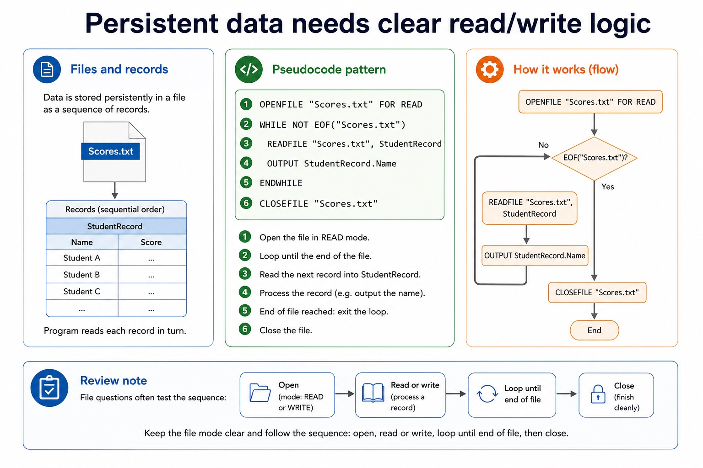

Text transcript

- Files and records
- Pseudocode pattern
- OPENFILE "Scores.txt" FOR READ
- WHILE NOT EOF("Scores.txt")
- READFILE "Scores.txt", StudentRecord
- OUTPUT StudentRecord.Name
- ENDWHILE
- CLOSEFILE "Scores.txt"

Precise syllabus wording

Paper 2 review: algorithm design and data structures

Use the diagrams to retrieve the method, compare similar ideas and correct one typical error.

### 2. Paper 2 review: programming constructs and file handling (R090.149)

**Concept map:** Paper 2 review: programming constructs and…

**Three-part explanation:**

1. Use the diagrams to retrieve the method, compare similar ideas and correct one typical error
2. Use one fresh scenario to apply paper 2 integrated review and pseudocode clinic, showing each decision or calculation step and checking the result against the question…
3. Compare the principles, benefits and drawbacks of waterfall, iterative and Rapid Application Development (RAD)

**Concrete cue:** Programming constructs

#### Constructs control the order in which statements run

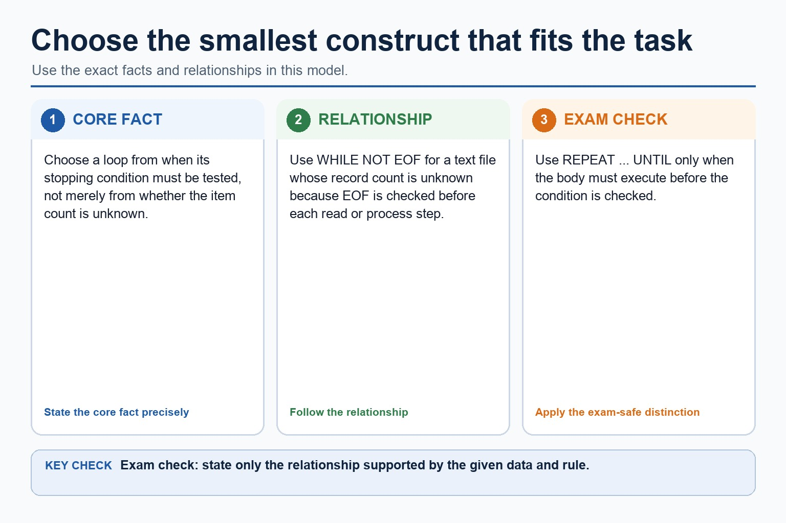

Text transcript

- Programming constructs
- Construct
- Cambridge-style signal
- Common error
- Sequence
- statements run in order
- one statement after another
- assuming hidden jumps

#### Open the file in the correct mode, process records, then close it

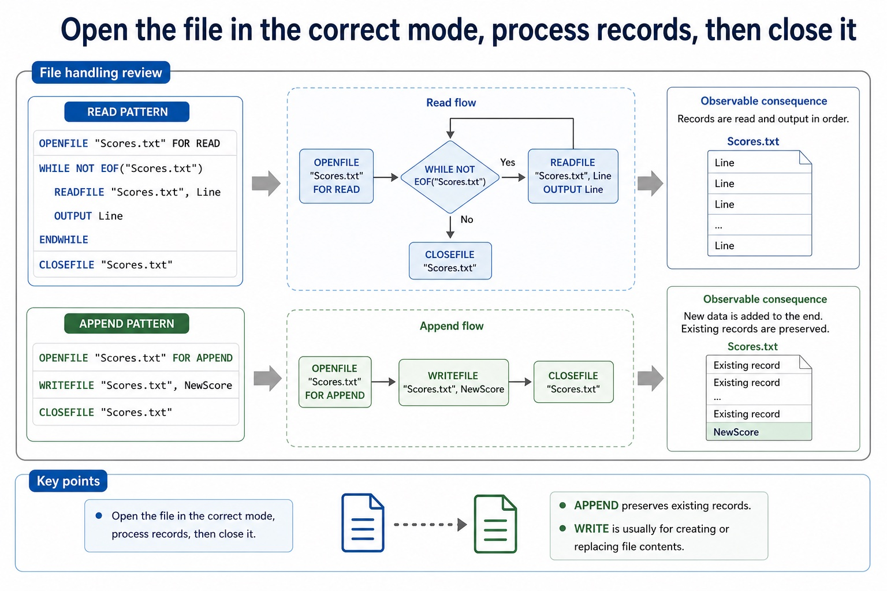

Text transcript

- File handling review
- Read pattern
- OPENFILE "Scores.txt" FOR READ
- WHILE NOT EOF("Scores.txt")
- READFILE "Scores.txt", Line
- OUTPUT Line
- ENDWHILE
- CLOSEFILE "Scores.txt"

#### Identify the construct from the scenario

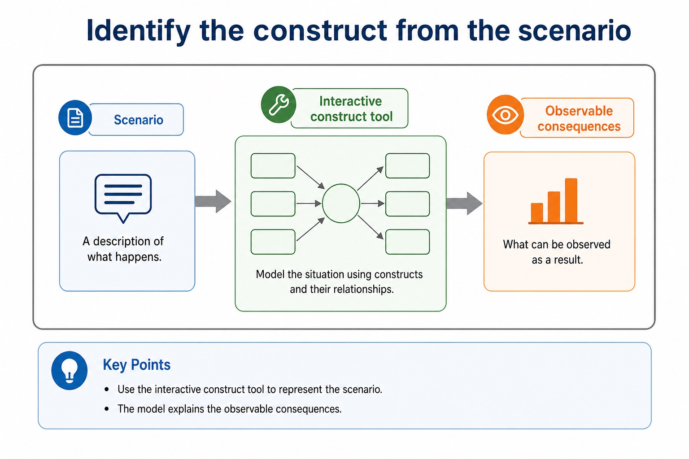

Text transcript

- Interactive construct tool
- Scenario

Precise syllabus wording

Paper 2 review: programming constructs and file handling

Use the diagrams to retrieve the method, compare similar ideas and correct one typical error.

### 3. Paper 2 timed pseudocode practice (R090.150)

**Concept map:** Paper 2 timed pseudocode practice

**Three-part explanation:**

1. Use the diagrams to retrieve the method, compare similar ideas and correct one typical error
2. Use one fresh scenario to apply paper 2 integrated review and pseudocode clinic, showing each decision or calculation step and checking the result against the question…
3. The Version 2 Notes name integer, real, char, string, Boolean and date, and require the Cambridge pseudocode type names INTEGER, REAL, CHAR, STRING, BOOLEAN, DATE, ARRAY…

**Concrete cue:** Use one fresh scenario to apply paper 2 integrated review and pseudocode clinic, showing each decision or calculation step and checking the result against the question context.

#### Spend time according to marks

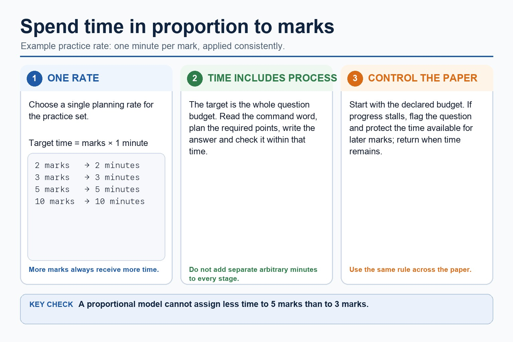

Text transcript

- Use one declared mark-to-time rate consistently across timed pseudocode practice.
- The example rate is one minute per mark: 2, 3, 5 and 10 marks receive 2, 3, 5 and 10 minutes.
- The whole question budget includes reading, planning, writing and checking.
- A proportional model always allocates more time to a higher-mark question.

#### Before moving on, ask six questions

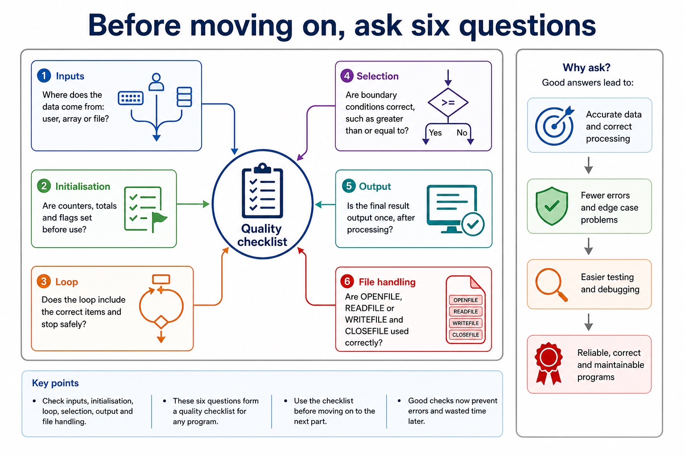

Text transcript

- Quality checklist
- Inputs Where does the data come from: user, array or file?
- Initialisation Are counters, totals and flags set before use?
- Loop Does the loop include the correct items and stop safely?
- Selection Are boundary conditions correct, such as greater than or equal to?
- Output Is the final result output once, after processing?
- File handling Are OPENFILE, READFILE or WRITEFILE and CLOSEFILE used correctly?

#### Choose a mark value and plan the response

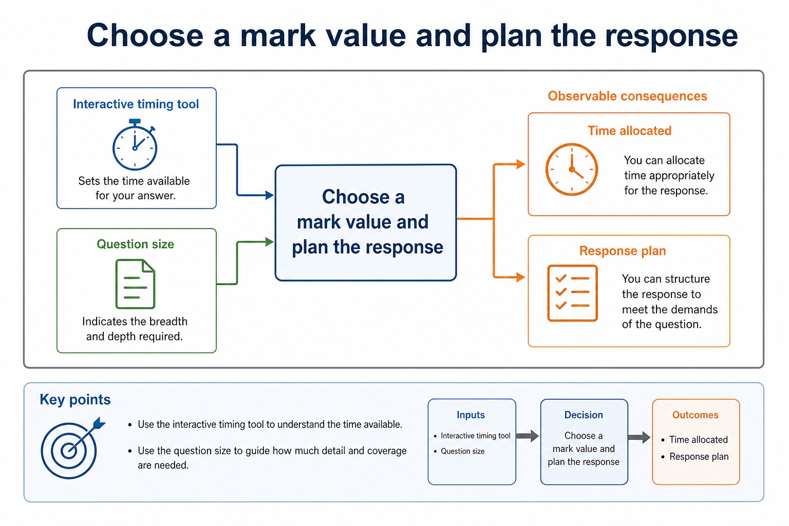

Text transcript

- Interactive timing tool
- Question size

Precise syllabus wording

Paper 2 timed pseudocode practice

Use the diagrams to retrieve the method, compare similar ideas and correct one typical error.

### 4. Paper 2 mock review and correction clinic (R090.151)

**Concept map:** Paper 2 mock review and correction…

**Three-part explanation:**

1. Use the diagrams to retrieve the method, compare similar ideas and correct one typical error
2. Use one fresh scenario to apply paper 2 integrated review and pseudocode clinic, showing each decision or calculation step and checking the result against the question…
3. Compare the principles, benefits and drawbacks of waterfall, iterative and Rapid Application Development (RAD)

**Concrete cue:** Use one fresh scenario to apply paper 2 integrated review and pseudocode clinic, showing each decision or calculation step and checking the result against the question context.

#### The four-line correction format

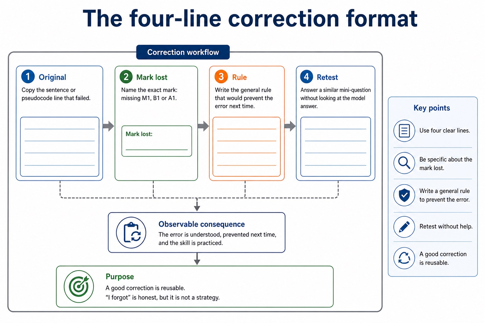

Text transcript

- Correction workflow
- 1. Original
- Copy the sentence or pseudocode line that failed.
- 2. Mark lost
- Name the exact mark: missing M1, B1 or A1.
- Write the general rule that would prevent the error next time.
- 4. Retest
- Answer a similar mini-question without looking at the model answer.

#### Sort errors before trying to fix everything

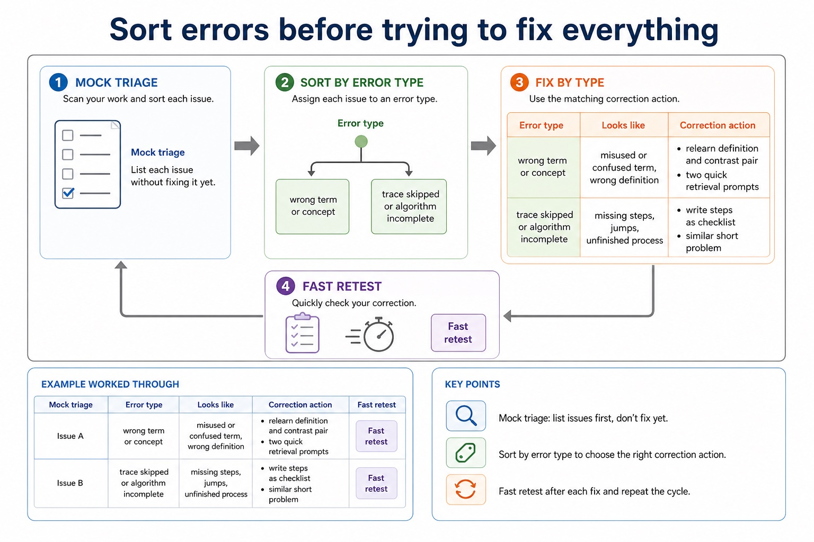

Text transcript

- Mock triage
- Error type
- Looks like
- Correction action
- Fast retest
- Knowledge
- wrong term or concept
- relearn definition and contrast pair

#### Know which skill the mark scheme is testing

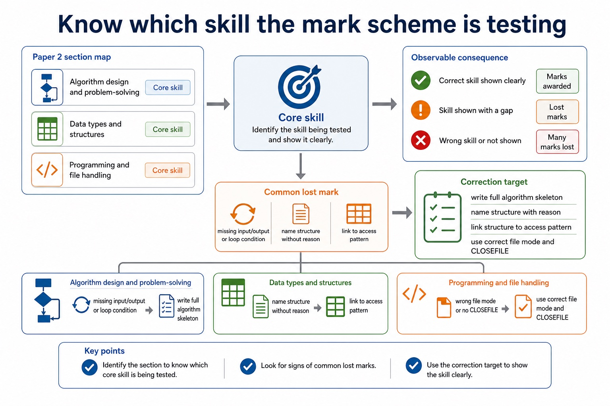

Text transcript

- Paper 2 section map
- Core skill
- Common lost mark
- Correction target
- algorithm design and problem-solving
- missing input/output or loop condition
- write full algorithm skeleton
- data types and structures

Precise syllabus wording

Paper 2 mock review and correction clinic

Use the diagrams to retrieve the method, compare similar ideas and correct one typical error.

### Supporting diagram library

#### The reason matters more than the name

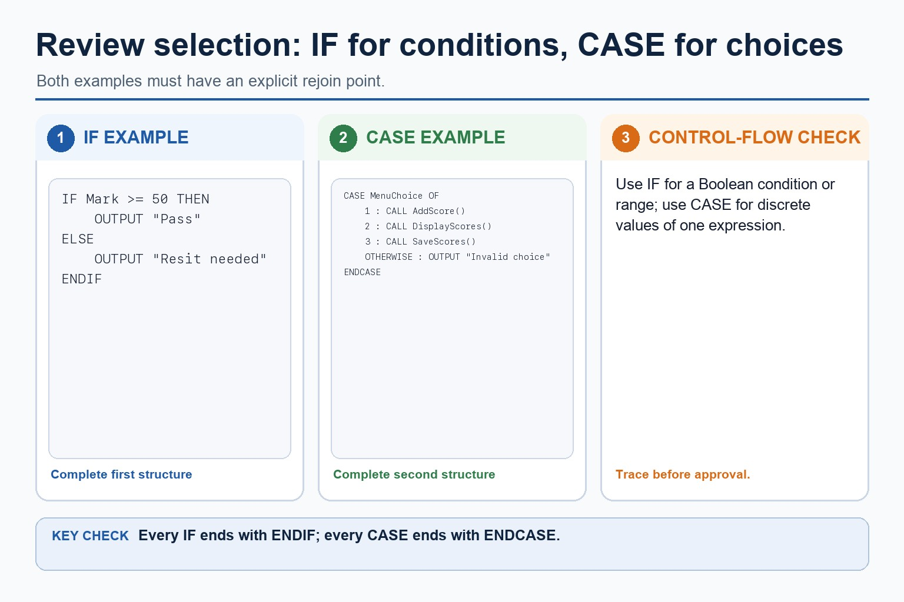

Text transcript

- Structure choice
- Scenario
- Likely structure
- store 30 daily temperatures
- 1D array
- same type, indexed by day
- store student name, ID and mark
- related fields of different types

#### Choose the tool before writing the answer

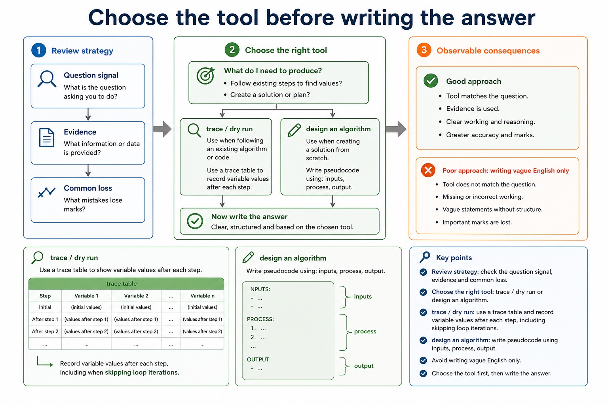

Text transcript

- Review strategy
- Question signal
- Evidence
- Common loss
- trace / dry run
- trace table
- variable values after each step
- skipping loop iterations

#### Choose the structure and explain why

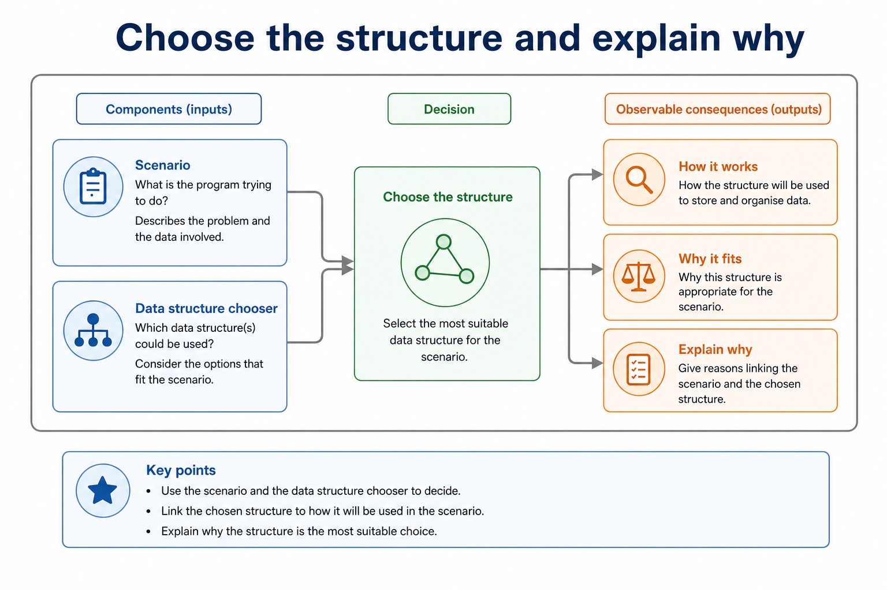

Text transcript

- Data structure chooser
- Scenario

#### Calculate Total for the selected score list

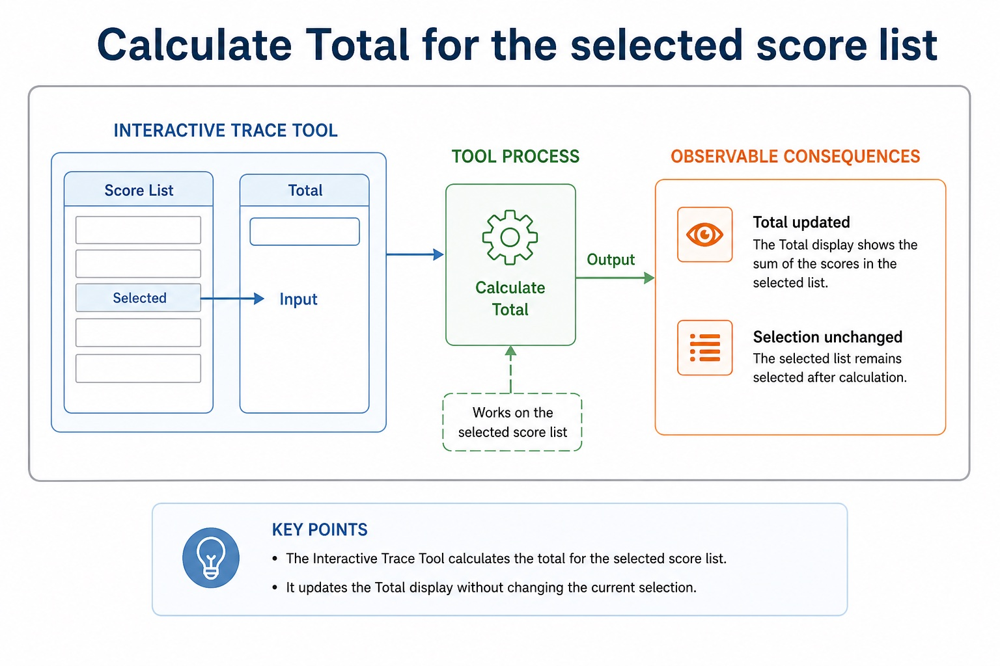

Text transcript

- Interactive trace tool

#### Choose READ, WRITE or APPEND

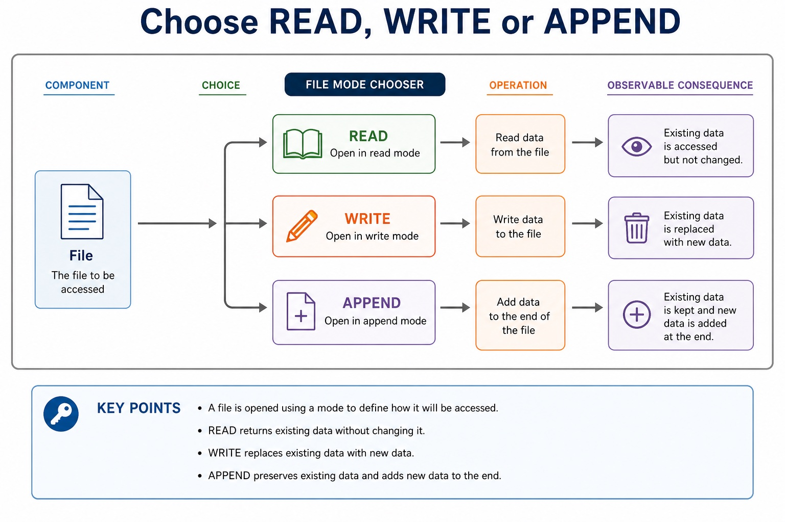

Text transcript

- File mode chooser

#### Choose the loop by what is known before the loop starts

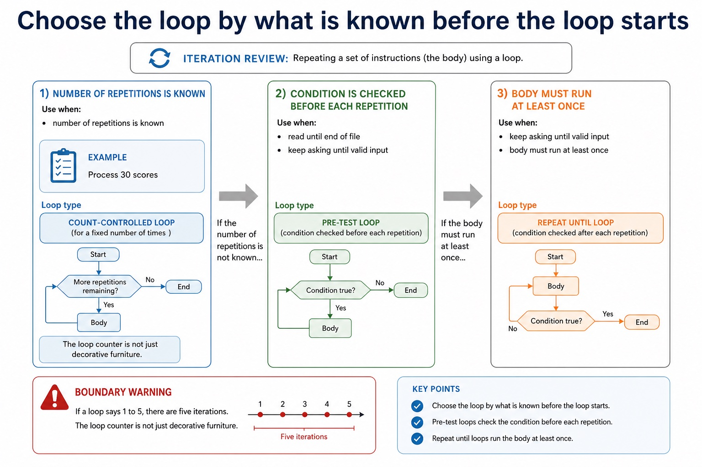

Text transcript

- Iteration review
- Use when
- number of repetitions is known
- process 30 scores
- condition is checked before each repetition
- read until end of file
- REPEAT UNTIL
- body must run at least once

#### Use IF for decisions, CASE for clean multi-way choices

Text transcript

- Use IF for a condition or range and close it with ENDIF.
- Use CASE for discrete MenuChoice values and close it with ENDCASE.
- OTHERWISE handles a menu choice not listed explicitly.

#### Subprograms reduce repetition and make code testable

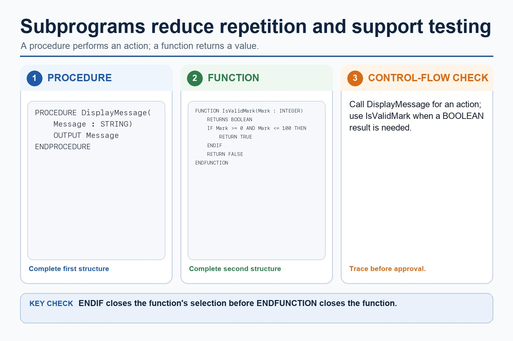

Text transcript

- DisplayMessage is a procedure that outputs its parameter and returns no value.
- IsValidMark is a function that returns a BOOLEAN.
- Close the function's selection with ENDIF before ENDFUNCTION.
- Use subprograms to reduce repetition and support separate testing.

#### Validation rejects unsuitable input before it damages the logic

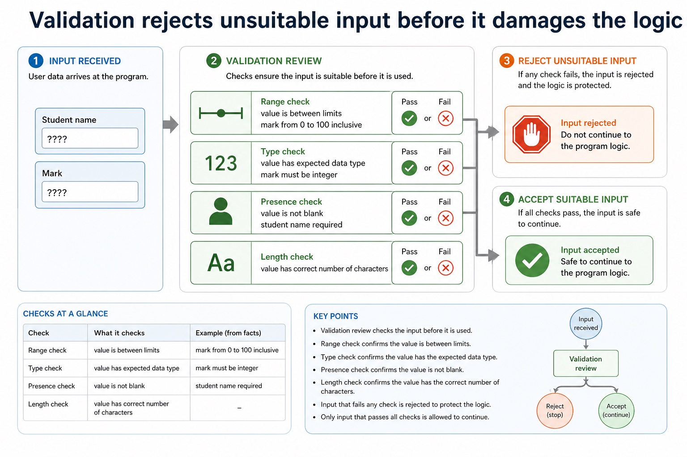

Text transcript

- Validation review
- Range check
- value is between limits
- mark from 0 to 100 inclusive
- Type check
- value has expected data type
- mark must be integer
- Presence check

#### Choose the smallest construct that fits the task

Text transcript

- Choose a loop from when its stopping condition must be tested, not merely from whether the item count is unknown.
- Use WHILE NOT EOF for a text file whose record count is unknown because EOF is checked before each read or process step.
- Use REPEAT ... UNTIL only when the body must execute before the condition is checked.

#### The four-pass approach

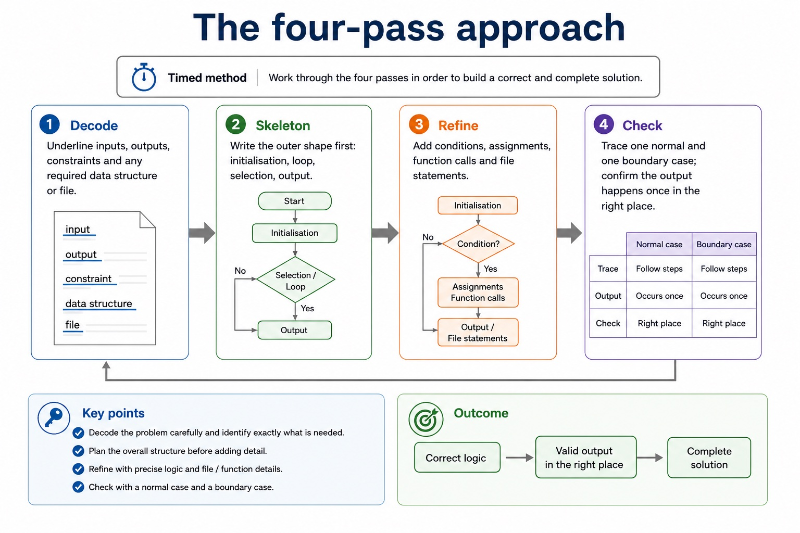

Text transcript

- Timed method
- 1. Decode
- Underline inputs, outputs, constraints and any required data structure or file.
- 2. Skeleton
- Write the outer shape first: initialisation, loop, selection, output.
- Add conditions, assignments, function calls and file statements.
- 4. Check
- Trace one normal and one boundary case; confirm the output happens once in the right place.

#### Build the outer shape before details

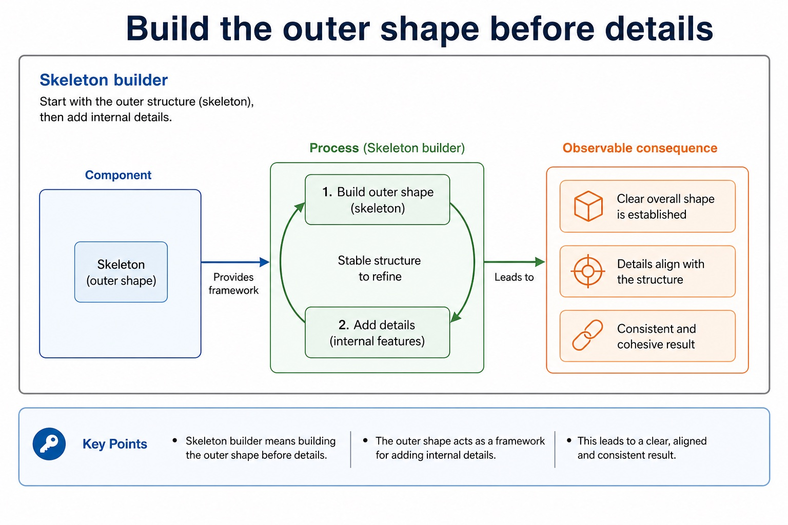

Text transcript

- Skeleton builder

#### Translate feedback into a repeatable checklist

Text transcript

- Mark recovery
- Pseudocode initialise variables, process all items, output after the loop, close files
- Trace show intermediate values and include boundary conditions
- Data structures justify with LIFO, FIFO, index access or grouped fields
- Explanations use point, reason, context and consequence
- Testing include data, expected result and why the case is useful
- Evaluation compare evidence with success criteria and make a judgement

Open precise terminology and exam facts

- Use stepwise refinement to develop an algorithm from a high-level solution to a level of detail from which a program can be written; each level must preserve the parent purpose.
- Select and use appropriate types for a problem solution. The Version 2 Notes name integer, real, char, string, Boolean and date, and require the Cambridge pseudocode type names INTEGER, REAL, CHAR, STRING, BOOLEAN, DATE, ARRAY and FILE.
- Define and use a procedure; explain when the use of a procedure is appropriate; use parameters with none, one or more values passed by reference or by value.
- Candidates should understand the purpose of a program-development lifecycle and the need for different lifecycles depending on the program being developed. Compare the principles, benefits and drawbacks of waterfall, iterative and Rapid Application Development (RAD). Lifecycle stages are analysis, design, coding, testing and maintenance.

### Worked example

1. Use one fresh scenario to apply paper 2 integrated review and pseudocode clinic, showing each decision or calculation step and checking the result against the question context.

Beyond syllabus / 延伸知识（不要求背诵）: modern teams often use continuous integration to repeat building and testing whenever a program changes.
## 3. Practice by question type

### Question 1 - foundation - write - 8 marks

Write Cambridge pseudocode for a linear search of Name[1:20] and an ascending bubble sort of Score[1:20].

**Answer:** linear search initialises Found and Index; linear search loops within indexes 1 to 20 until found or exhausted; linear search compares Name[Index] with the target and records a match; bubble sort uses repeated passes; compares adjacent Score[Index] and Score[Index + 1] within valid bounds; uses Temp or an equivalent safe three-step swap; reduces the unsorted range or uses a valid no-swap stopping condition; all constructs close coherently in Cambridge pseudocode

**Marking guidance:** Do not award only a trace or a description; both requested algorithms must be written and must not access Index + 1 beyond the upper bound.

**Common error:** For the command word write, perform that exact action; do not replace it with an unrelated fact.

### Question 2 - application - explain - 3 marks

Explain one common error from Section 11: Programming, and give the corrected reasoning.

**Answer:** Define and use a procedure; explain when the use of a procedure is appropriate; use parameters with none, one or more values passed by reference or by value.

**Marking guidance:** Credit distinct syllabus-accurate points that follow the command word.

**Common error:** Do not repeat the same point in different words; each mark needs a separate idea or method step.

### Question 3 - application - compare - 4 marks

Compare two closely related ideas from Section 9: Algorithm design and problem-solving.

**Answer:** Use stepwise refinement to develop an algorithm from a high-level solution to a level of detail from which a program can be written; each level must preserve the parent purpose.

**Marking guidance:** Credit distinct syllabus-accurate points that follow the command word.

**Common error:** Do not copy the worked example unchanged; transfer the method and check it against the new context.

### Question 4 - transfer - apply - 4 marks

Apply one method from Section 12: Software development to a fresh exam context.

**Answer:** Candidates should understand the purpose of a program-development lifecycle and the need for different lifecycles depending on the program being developed. Compare the principles, benefits and drawbacks of waterfall, iterative and Rapid Application Development (RAD). Lifecycle stages are analysis, design, coding, testing and maintenance.

**Marking guidance:** Credit distinct syllabus-accurate points that follow the command word.

**Common error:** Do not copy the worked example unchanged; transfer the method and check it against the new context.

### Related past-paper indexes

| Reference | Marks | Command word | Question type |
|---|---:|---|---|
| 9618/21/S/25 Q3 | 8 | write | recall |
| 9618/21/S/25 Q6(b) | 8 | complete | recall |
| 9618/21/S/25 Q7(i) | 8 | write | calculate |
| 9618/21/W/25 Q8(b) | 8 | define | recall |

These are indexes only. Cambridge question and mark-scheme wording is not reproduced.

## 4. Summary and exam reminders

### Summary

- Define paper 2 integrated review and pseudocode clinic with the exact technical vocabulary expected by the syllabus.
- Use the lesson method on a fresh context and show the intermediate decision, representation or calculation.
- Match the shape of the answer to the command word and the available marks.
- Check the final answer against the scenario instead of repeating a memorised sentence.

### Common error to correct

Students often revise by rereading notes only. Correction: review lessons require retrieval, timed practice and correction.

### Exam technique

- Follow the command word: state gives a fact; explain links a cause to a consequence; compare covers both sides.
- Match the number of independent points or method steps to the available marks.
- For paper 2 integrated review and pseudocode clinic, use the exact technical term before applying it to the scenario.

**Optional extra practice:** Correct one answer from a timed attempt and record the exact reason each lost mark was lost.
